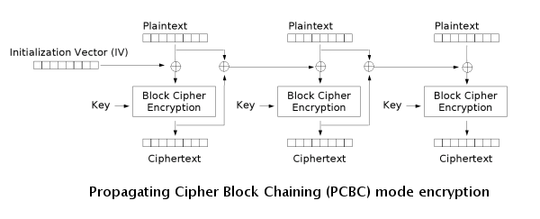

# Block Ciphers

A **Block Cipher** is an algorithm which is used in conjunction with a cryptosystem in order to package a message into evenly distributed 'blocks' which are encrypted one at a time.

## Definitions

- Mode of Operation: How a block cipher is applied to an amount of data which exceeds a block's size
- Initialization Vector (IV): A sequence of bytes which is used to randomize encryption even if the same plaintext is encrypted
- Starting Variable (SV): Similar to the IV, except it is used during the first block to provide a random seed during encryption
- Padding: Padding is used to ensure that the block sizes all line up and ensure the last block fits the block cipher
- Plaintext: Unencrypted text; Data without obfuscation
- Key: A secret used to encrypt plaintext
- Ciphertext: Plaintext encrypted with a key

## Common Block Ciphers

| Mode | Formulas | Ciphertext |
| ---- | ---- | ---- |
| ECB |	Y~i~ = F(PlainText~i~, Key) | Y~i~
| CBC	|Y~i~ = PlainText~i~ XOR Ciphertext~i-1~ | F(Y, key); Ciphertext~0~ = IV
| PCBC |	Y~i~ = PlainText~i~ XOR (Ciphertext~i-1~ XOR PlainText~i-1~) | F(Y, key); Ciphertext~0~ = IV
| CFB | Y~i~ = Ciphertext~i-1~ | Plaintext XOR F(Y, key); Ciphertext~0~ = IV
| OFB |	Y~i~ = F(Key, I~i-1~);Y~0~=IV | Plaintext XOR Y~i~
| CTR |	Y~i~ = F(Key, IV + g(i));IV = token(); | Plaintext XOR Y~i~

!!!note
	In this case ~i~ represents an index over the # of blocks in the plaintext. F() and g() represent the function used to convert plaintext into ciphertext.

### Electronic Codebook (ECB)

ECB is the most basic block cipher, it simply chunks up plaintext into blocks and independently encrypts those blocks and chains them all into a ciphertext.

#### Flaws

Because ECB independently encrypts the blocks, patterns in data can still be seen clearly, as shown in the CBC Penguin image below.

| Original Image | ECB Image | Other Block Cipher Modes |
| --- | --- | --- |
|  |  | |

### Cipher Block Chaining (CBC)

CBC is an improvement upon ECB where an Initialization Vector is used in order to add randomness. The encrypted previous block is used as the IV for each sequential block meaning that the encryption process cannot be parallelized. CBC has been declining in popularity due to a variety of

!!!note
	Even though the encryption process cannot be parallelized, the decryption process can be parallelized. If the wrong IV is used for decryption it will only affect the first block as the decryption of all other blocks depends on the *ciphertext* not the plaintext.

### Propogating Cipher Block Chaining (PCBC)

PCBC is a less used cipher which modifies CBC so that decryption is also not parallelizable. It also cannot be decrypted from any point as changes made during the decryption and encryption process "propogate" throughout the blocks, meaning that both the plaintext and ciphertext are used when encrypting or decrypting as seen in the images below.

### Counter (CTR)

!!!note
	Counter is also known as CM, integer counter mode (ICM), and segmented integer counter (SIC)

CTR mode makes the block cipher similar to a stream cipher and it functions by adding a counter with each block in combination with a nonce and key to XOR the plaintext to produce the ciphertext. Similarly, the decryption process is the exact same except instead of XORing the plaintext, the ciphertext is XORed. This means that the process is parallelizable for both encryption and decryption *and* you can begin from anywhere as the counter for any block can be deduced easily.

#### Security Considerations

If the nonce chosen is non-random, it is important to concatonate the nonce with the counter (high 64 bits to the nonce, low 64 bits to the counter) as adding or XORing the nonce with the counter would break security as an attacker can cause a collisions with the nonce and counter. An attacker with access to providing a plaintext, nonce and counter can then decrypt a block by using the ciphertext as seen in the decryption image.

## Padding Oracle Attack

A Padding Oracle Attack sounds complex, but essentially means abusing a block cipher by changing the length of input and being able to determine the plaintext.

### Requirements

- An oracle, or program, which encrypts data using CBC
- Continual use of the same key

### Execution

1. If we have two blocks of ciphertext, C~1~ and C~2~, we can get the plaintext P~2~
2. Since we know that CBC decryptionis dependent on the prior ciphertext, if we change the last byte of C~1~ we can see if C~2~ has correct padding
3. If it is correctly padded we know that the last byte of the plaintext
4. If not, we can increase our byte by one and repeat until we have a successful padding
5. We then repeat this for all successive bytes following C~1~ and if the block is 16 bytes we can expect a maximum of 4080 attempts which is trivial
