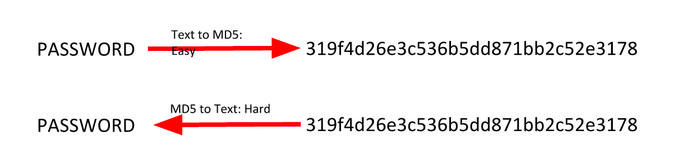
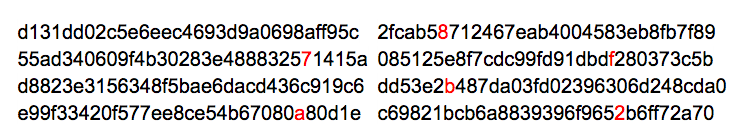
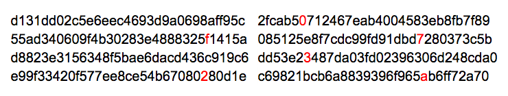

# Hashing Functions

Hashing functions are one way functions which theoretically provide a unique output for every input. MD5, SHA-1, and other hashes which were considered secure are now found to have *collisions* or two different pieces of data which produce the same supposed unique output.

## String Hashing

A string hash is a number or string generated using an algorithm that runs on text or data.

The idea is that each hash should be unique to the text or data (although sometimes it isn’t). For example, the hash for “dog” should be different from other hashes.

You can use command line tools tools or online resources such as this one.
Example:
`$ echo -n password | md5  5f4dcc3b5aa765d61d8327deb882cf99`
Here, “password” is hashed with different hashing algorithms:

* **SHA-1**: 5BAA61E4C9B93F3F0682250B6CF8331B7EE68FD8
* **SHA-2**: 5E884898DA28047151D0E56F8DC6292773603D0D6AABBDD62A11EF721D1542D8
* **MD5**: 5F4DCC3B5AA765D61D8327DEB882CF99
* **CRC32**: BBEDA74F

Generally, when verifying a hash visually, you can simply look at the first and last four characters of the string.

## File Hashing

A file hash is a number or string generated using an algorithm that is run on text or data. The premise is that it should be unique to the text or data. If the file or text changes in any way, the hash will change.

What is it used for?
- File and data identification
- Password/certificate storage comparison

How can we determine the hash of a file? You can use the md5sum command (or similar).

```bash
$ md5sum samplefile.txt
3b85ec9ab2984b91070128be6aae25eb samplefile.txt
```

## Hash Collisions

A collision is when two pieces of data or text have the same cryptographic hash. This is very rare.

What’s significant about collisions is that they can be used to crack password hashes. Passwords are usually stored as hashes on a computer, since it’s hard to get the passwords from hashes.



If you bruteforce by trying every possible piece of text or data, eventually you’ll find something with the same hash. Enter it, and the computer accepts it as if you entered the actual password.

Two different files on the same hard drive with the same cryptographic hash can be very interesting.

“It’s now well-known that the cryptographic hash function MD5 has been broken,” [said Peter Selinger of Dalhousie University](http://www.mscs.dal.ca/~selinger/md5collision/). “In March 2005, Xiaoyun Wang and Hongbo Yu of Shandong University in China published an article in which they described an algorithm that can find two different sequences of 128 bytes with the same MD5 hash.”

For example, he cited this famous pair:



and



Each of these blocks has MD5 hash 79054025255fb1a26e4bc422aef54eb4.

Selinger said that “the algorithm of Wang and Yu can be used to create files of arbitrary length that have identical MD5 hashes, and that differ only in 128 bytes somewhere in the middle of the file. Several people have used this technique to create pairs of interesting files with identical MD5 hashes.”

Ben Laurie [has a nice website that visualizes this MD5 collision](http://www.links.org/?p=6). For a non-technical, though slightly outdated, introduction to hash functions, see [Steve Friedl’s Illustrated Guide](http://www.unixwiz.net/techtips/iguide-crypto-hashes.html). And [here’s a good article](http://www.forensicmag.com/articles/2008/12/hash-algorithm-dilemma–hash-value-collisions) from DFI News that explores the same topic.
