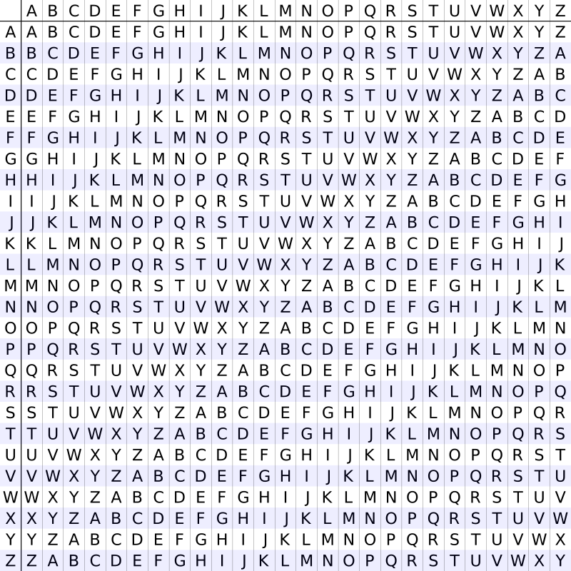

# Vigenere Cipher

A Vigenere Cipher is an extended [Caesar Cipher]() where a message is encrypted using various Caesar shifted alphabets.

The following table can be used to encode a message:

## Encryption
For example, encrypting the text `SUPERSECRET` with `CODE` would follow this process:

1. `CODE` gets padded to the length of `SUPERSECRET` so the key becomes `CODECODECOD`
2. For each letter in `SUPERSECRET` we use the table to get the Alphabet to use, in this instance row `C` and column `S`
3. The ciphertext's first letter then becomes `U`
4. We eventually get `UISITGHGTSW`

## Decryption

1. Go to the row of the key, in this case `C` 
2. Find the letter of the cipher text in this row, in this case `U`
3. The column is the first letter of the decrypted ciphertext, so we get `S`
4. After repeating this process we get back to `SUPERSECRET`