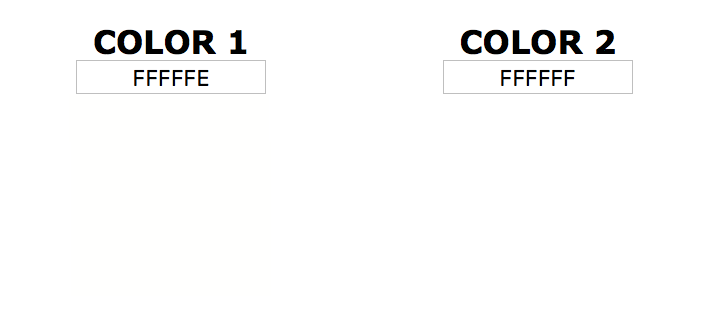

# Stegonagraphy

Stegonagraphy is the practice of hiding data in plain sight. Stegonagraphy is often embedded in images or audio.

## LSB Stegonagraphy

LSB Stegonagraphy or *Least Significant Bit* Stegonagraphy is a method of stegonagraphy where data is recorded in the lowest bit of a byte.

Say an image has a pixel with an RGB value of (255, 255, 255), the bits of those RGB values will look like

| 1 | 1 | 1 | 1 | 1 | 1 | 1 | 1 |
| --- | --- | --- | --- | --- | --- | --- | --- |

By modifying the lowest, or least significant, bit, we can use the 1 bit space across every RGB value for every pixel to construct a message.

| 1 | 1 | 1 | 1 | 1 | 1 | 1 | 0 |
| --- | --- | --- | --- | --- | --- | --- | --- |

The reason stegonagraphy is hard to detect by sight is because a 1 bit difference in color is insignificant as seen below.

