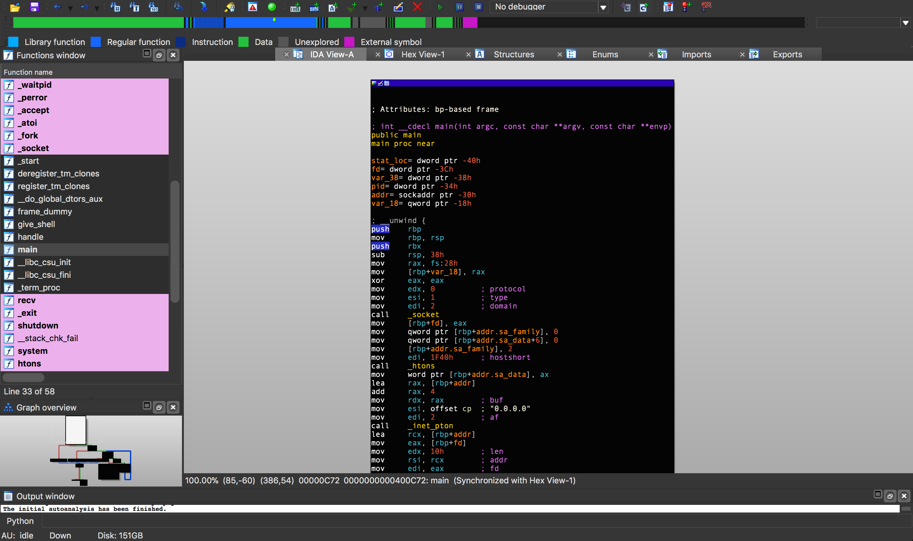

# Disassemblers

A **disassembler** is a tool which effectively breaks down a program into machine code.

## Disassemblers

- GNU Debugger (GDB)
- Binary Ninja
- IDA

### GDB 

The GNU Debugger is a free and open source debugger which also disassembles programs. It supports several languages, but most notably it is used by CTF players for any Unix specific C programs. 

### Binary Ninja

Only real competitor to IDA and provides a rich scripting enviornment along with sleek UI.

### IDA

The Interactive Disassembler is the industry standard for binary disassembly.

