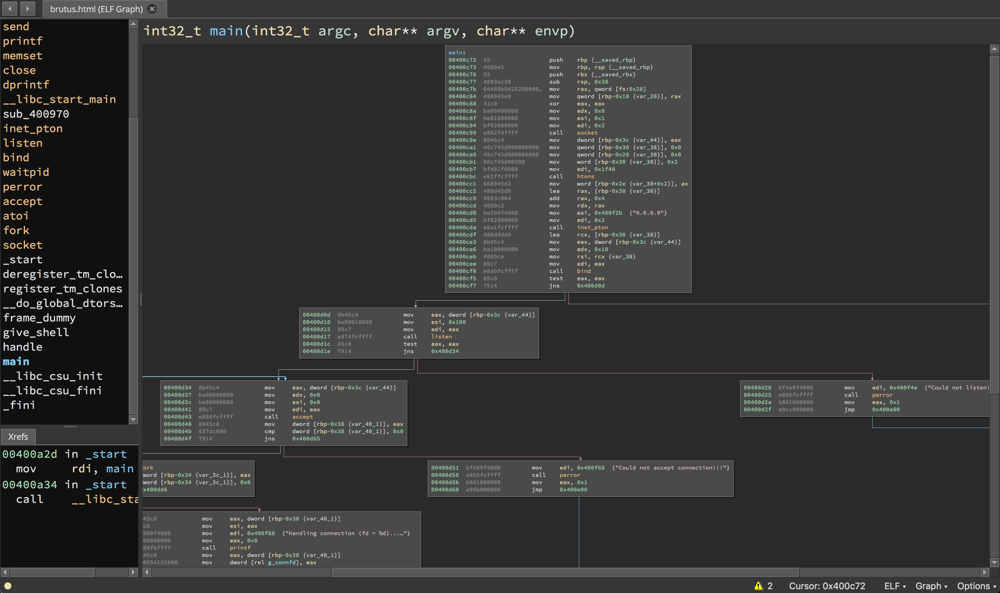

# Disassemblers

A **disassembler** is a tool which breaks down a compiled program into machine code.

## List of Disassemblers

- IDA
- Binary Ninja
- GNU Debugger (GDB)
- radare2
- Hopper

### IDA

The Interactive Disassembler (IDA) is the industry standard for binary disassembly. IDA is capable of disassembling "virtually any popular file format". This makes it very useful to security researchers and CTF players who often need to analyze obscure files without knowing what they are or where they came from. IDA also features the industry leading Hex Rays decompiler which can convert assembly code back into a pseudo code like format.

IDA also has a plugin interface which has been used to create some successful plugins that can make reverse engineering easier:

 * https://github.com/google/binnavi
 * https://github.com/yegord/snowman
 * https://github.com/gaasedelen/lighthouse
 * https://github.com/joxeankoret/diaphora
 * https://github.com/REhints/HexRaysCodeXplorer
 * https://github.com/osirislab/Fentanyl

### Binary Ninja

Binary Ninja is an up and coming disassembler that attempts to bring a new, more programmatic approach to reverse engineering. Binary Ninja brings an improved plugin API and modern features to reverse engineering. While it's less popular or as old as IDA, Binary Ninja (often called binja) is quickly gaining ground and has a small community of dedicated users and followers.

Binja also has some community contributed plugins which are collected here: https://github.com/Vector35/community-plugins

### gdb

The GNU Debugger is a free and open source debugger which also disassembles programs. It's capable as a disassembler, but most notably it is used by CTF players for its debugging and dynamic analysis capabailities.

gdb is often used in tandom with enhancement scripts like [peda](https://github.com/longld/peda), [pwndbg](https://github.com/pwndbg/pwndbg), and [GEF](https://github.com/hugsy/gef)

