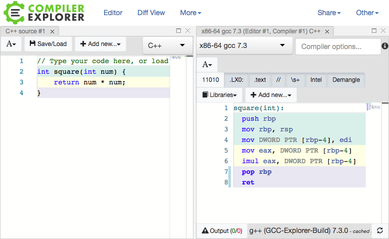

# The C Programming Language

## History

The C programming language iwas written by Dennis Ritchie in the 1970s while he was working at Bell Labs. It was first used to reimplement the Unix operating system which was purely written in assembly language. At first, the Unix developers were considering using a language called "B" but because B wasn't optimized for the target computer, the C language was created.

!!! note
    C is the letter and the programming language after B!

C was designed to be close to assembly and is still widely used in lower level programming where speed and control are needed (operating systems, embedded systems). C was also very influential to other programming langauges used today. Notable languages include C++, Objective-C, Golang, Java, JavaScript, PHP, Python, and Rust.


## Hello World

```c
#include <stdio.h>
int main()
{
   printf("Hello, World!");
   return 0;
}
```


## Today

Today C is widely used either as a low level programming langauge or is the base language that other programming languages are implemented in.

While it can be difficult to see, the C language compiles down directly into machine code. The compiler is programmed to process the provided C code and emit assembly that's targetted to whatever operating system and architecture the compiler is set to use.

Some common compilers include:

 * gcc
 * clang

A good way to explore this relationship is to use this online [GCC Explorer](https://godbolt.org/#) from Matt Godbolt.



In regards to CTF, many reverse engineering and exploitation CTF challenges are written in C because the language compiles down directly to assembly and there are little to no safeguards in the language. This means developers must manually handle both. Of course, this can lead to mistakes which can sometimes lead to security issues.

!!! note
    Other higher level langauges like Python manage memory and garbage collection for you. Google Golang was inspired by C but adds in functionality like garbage collection, and memory safety.

There are some examples of famously vulnerable functions in C which are still available and can still result in vulnerabilities:

 * `gets` - Can result in buffer overflows
 * `strcpy` - Can result in buffer overflows
 * `strcat` - Can result in buffer overflows
 * `strcmp` - Can result in timing attacks

## Types

C has four basic types:

 * char - characters
 * int - integers (e.g. 125)
 * float - 32 bit floating point number (e.g. 2.4)
 * double - 64 bit floating point number (like a float but more precise in terms of decimal points)

## Pointers

C uses an idea known as pointers. A pointer is a variable which contains the address of another variable.

To understand this idea we should first understand that memory is laid out in terms of addresses and data gets stored at these addresses.

```c
int x = 4;
```

To the programmer this looks as the variable `x` is receiving the value of 4. The computer stores this value in some location in memory. For example we can say that address `0x1000` now holds the value `4`. The computer knows to directly access the memory and retrieve the value 4 whenever the programmer tries to use the `x` variable.

But in C we can retrieve the memory address being used to hold the 4 value (i.e. 0x1000).

```c
int* y = &x;
```

!!! note
    The `&` character allows us to access the memory address of a variable.

The `y` variable will store the address pointed to by the x variable (0x1000).

!!! note
    The `*` character allows us to declare pointer variables but also allows us to access the value stored at a pointer. For example, entering `*y` allows us to access the 4 value instead of 0x1000.

Whenever we use the `y` variable we are using the memory address, but if we use the x variable we use the value stored at the memory address.

## Arrays

## Memory Management