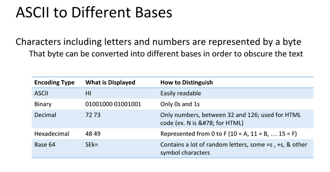
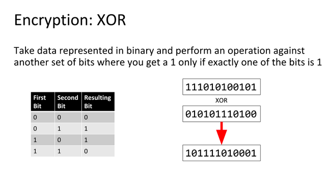

# XOR

## Data Representation

Data can be represented in different bases, an 'A' needs to be a numerical representation of Base 2 or binary so computers can understand them



## XOR Basics

An XOR or *eXclusive OR* is a bitwise operation indicated by `^` and shown by the following truth table:

| A | B | A ^ B |
| --- | --- | --- |
| 0 | 0 | 0 |
| 0 | 1 | 1 |
| 1 | 0 | 1 |
| 1 | 1 | 0 |

So what XOR'ing bytes in the action `0xA0 ^ 0x2C` translates to is:

| | | | | | | | |
| --- | --- | --- | --- | --- | --- | --- | --- |
| 1 | 0 | 1 | 0 | 0 | 0 | 0 | 0 |
| 0 | 0 | 1 | 0 | 1 | 1 | 0 | 0 |

| 1 | 0 | 0 | 0 | 1 | 1 | 0 | 0 |
| --- | --- | --- | --- | --- | --- | --- | --- |

`0b10001100` is equivelent to `0x8C`, a cool property of XOR is that it is reversable meaning `0x8C ^ 0x2C = 0xA0` and `0x8C ^ 0xA0 = 0x2C`



## What does this have to do with CTF?

XOR is a cheap way to encrypt data with a password. Any data can be encrypted using XOR as shown in this Python example:

```python
>>> data = 'CAPTURETHEFLAG'
>>> key = 'A'
>>> encrypted = ''.join([chr(ord(x) ^ ord(key)) for x in data])
>>> encrypted
'\x02\x00\x11\x15\x14\x13\x04\x15\t\x04\x07\r\x00\x06'
>>> decrypted = ''.join([chr(ord(x) ^ ord(key)) for x in encrypted])
>>> decrypted
'CAPTURETHEFLAG'
```

This can be extended using a multibyte key by iterating in parallel with the data.

## Exploiting XOR Encryption

### Single Byte XOR Encryption
Single Byte XOR Encryption is trivial to bruteforce as there are only 255 key combinations to try.

### Multibyte XOR Encryption
Multibyte XOR gets exponentially harder the longer the key, but if the encrypted text is long enough, character frequency analysis is a viable method to find the key. Character Frequency Analysis means that we split the cipher text into groups based on the number of characters in the key. These groups then are bruteforced using the idea that some letters appear more frequently in the english alphabet than others.