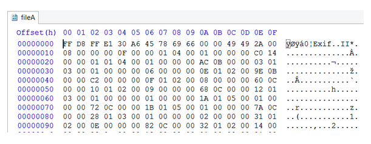

# Hex Editor

A hexadecimal (hex) editor (also called a binary file editor or byte editor) is a computer program you can use to manipulate the fundamental binary data that constitutes a computer file. The name “hex” comes from “hexadecimal,” a standard numerical format for representing binary data. A typical computer file occupies multiple areas on the platter(s) of a disk drive, whose contents are combined to form the file. Hex editors that are designed to parse and edit sector data from the physical segments of floppy or hard disks are sometimes called sector editors or disk editors. A hex editor is used to see or edit the raw, exact contents of a file. Hex editors may used to correct data corrupted by a system or application. A [list of editors](http://forensicswiki.org/wiki/Tools#Hex_Editors) can be found on the forensics Wiki. You can download one and install it on your system.

### Example

Open fileA.jpg in a hex editor. (Most Hex editors have either a “File > Open” option or a simple drag and drop.)

When you open fileA.jpg in your hex editor, you should see something similar to this:

Your hex editor should also have a “go to” or “find” feature so you can jump to a specific byte.