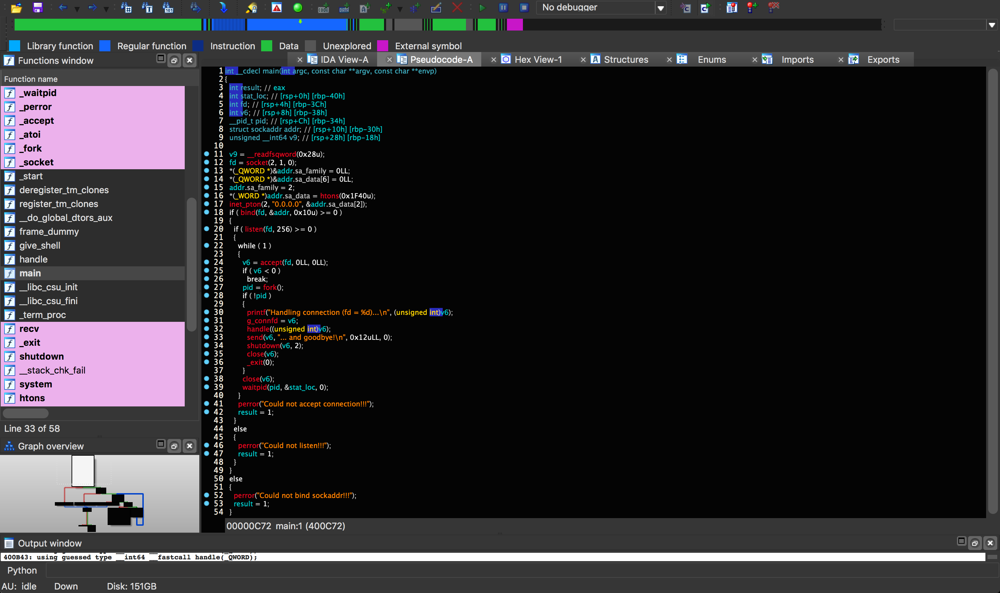

# Decompilers

Decompilers do the impossible and reverse compiled code *back* into psuedocode/code.

IDA offers HexRays, which translates machine code into a higher language pseudocode.



## Example Workflow

Let's say we are disassembling a program which has the source code:

```c
#include <stdio.h>

void printSpacer(int num){
    for(int i = 0; i < num; ++i){
        printf("-");
    }
    printf("\n");
}

int main()
{
    char* string = "Hello, World!";
    for(int i = 0; i < 13; ++i){
        printf("%c", string[i]);
        for(int j = i+1; j < 13; j++){
            printf("%c", string[j]);
        }
        printf("\n");
        printSpacer(13 - i);
    }
    return 0;
}
```

And creates an output of:

```
Hello, World!
-------------
ello, World!
------------
llo, World!
-----------
lo, World!
----------
o, World!
---------
, World!
--------
 World!
-------
World!
------
orld!
-----
rld!
----
ld!
---
d!
--
!
-

```

If we are given a binary compiled from that source and we want to figure out how the source looks, we can use a decompiler to get c pseudocode which we can then use to reconstruct the function. The sample decompilation can look like:

```c
printSpacer:
int __fastcall printSpacer(int a1)
{
  int i; // [rsp+8h] [rbp-8h]

  for ( i = 0; i < a1; ++i )
    printf("-");
  return printf("\n");
}

main:
int __cdecl main(int argc, const char **argv, const char **envp)
{
  int v4; // [rsp+18h] [rbp-18h]
  signed int i; // [rsp+1Ch] [rbp-14h]

  for ( i = 0; i < 13; ++i )
  {
    v4 = i + 1;
    printf("%c", (unsigned int)aHelloWorld[i], envp);
    while ( v4 < 13 )
      printf("%c", (unsigned int)aHelloWorld[v4++]);
    printf("\n");
    printSpacer(13 - i);
  }
  return 0;
}
```

A good method of getting a good representation of the source is to convert the decompilation into Python since Python is basically psuedocode that runs. Starting with main often allows you to gain a good overview of what the program is doing and will help you translate the other functions.

### Main

We know we will start with a main function and some variables, if you trace the execution of the variables, you can oftentimes determine the variable type. Because *i* is being used as an index, we know its an int, and because *v4* used as one later on, it too is an index. We can also see that we have a variable *aHelloWorld* being printed with "%c", we can determine it represents the 'Hello, World!' string. Lets define all these variables in our Python main function:

```python
def main():
    string = "Hello, World!"
    i = 0
    v4 = 0
    for i in range(0, 13):
        v4 = i + 1
        print(string[i], end='')
        while v4 < 13:
            print(string[v4], end='')
            v4 += 1
        print()
        printSpacer(13-i)
```

### printSpacer Function

Now we can see that printSpacer is clearly being fed an int value. Translating it into python shouldn't be too hard.

```python
def printSpacer(number):
    i = 0
    for i in range(0, number):
        print("-", end='')
    print()
```

### Results

Running main() gives us:

```
Hello, World!
-------------
ello, World!
------------
llo, World!
-----------
lo, World!
----------
o, World!
---------
, World!
--------
 World!
-------
World!
------
orld!
-----
rld!
----
ld!
---
d!
--
!
-

```