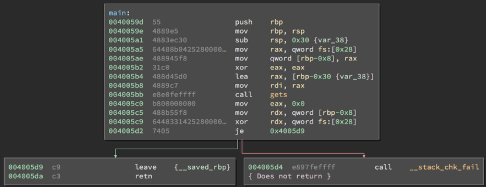

# Stack Canaries

Stack Canaries are a secret value placed on the stack which changes every time the program is started. Prior to a function return, the stack canary is checked and if it appears to be modified, the program exits immeadiately. 

## Bypassing Stack Canaries

Stack Canaries seem like a clear cut way to mitigate any stack smashing as it is fairly impossible to just guess a random 64-bit value. However, leaking the address and bruteforcing the canary are two methods which would allow us to get through the canary check.

### Stack Canary Leaking

If we can read the data in the stack canary, we can send it back to the program later because the canary stays the same throughout execution. However Linux makes this slightly tricky by making the first byte of the stack canary a NULL, meaning that string functions will stop when they hit it. A method around this would be to partially overwrite and then put the NULL back or find a way to leak bytes at an arbitrary stack offset.

A few situations where you might be able to leak a canary:

* User-controlled format string 
* User-controlled length of an output
	* “Hey, can you send me 1000000 bytes? thx!”

### Bruteforcing a Stack Canary

The canary is determined when the program starts up for the first time which means that if the program forks, it keeps the same stack cookie in the child process. This means that if the input that can overwrite the canary is sent to the child, we can use whether it crashes as an oracle and brute-force 1 byte at a time! 

This method can be used on fork-and-accept servers where connections are spun off to child processes, but only under certain conditions such as when the input accepted by the program does not append a NULL byte (**read** or **recv**).

| Buffer (N Bytes) | ?? ?? ?? ?? ?? ?? ?? ?? | RBP | RIP |
| --- | --- | --- | --- |

Fill the buffer N Bytes + 0x00 results in no crash

| Buffer (N Bytes) | 00 ?? ?? ?? ?? ?? ?? ?? | RBP | RIP |
| --- | --- | --- | --- |

Fill the buffer N Bytes + 0x00 + 0x00 results in a crash

N Bytes + 0x00 + 0x01 results in a crash

N Bytes + 0x00 + 0x02 results in a crash

...

N Bytes + 0x00 + 0x51 results in no crash

| Buffer (N Bytes) | 00 51 ?? ?? ?? ?? ?? ?? | RBP | RIP |
| --- | --- | --- | --- |

Repeat this bruteforcing process for 6 more bytes...

| Buffer (N Bytes) | 00 51 FE 0A 31 D2 7B 3C | RBP | RIP |
| --- | --- | --- | --- |

Now that we have the stack cookie, we can overwrite the RIP register and take control of the program!