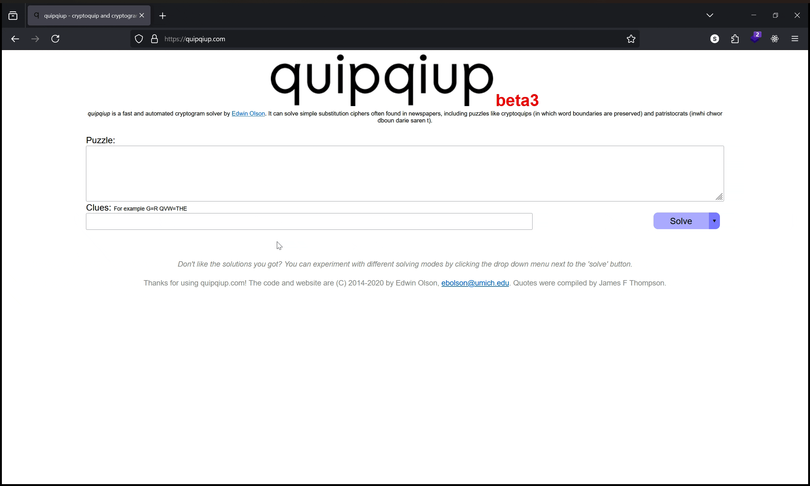

# Substitution Cipher

## Introduction

A Substitution Cipher is system of encryption where different symbols are substituted by a different alphabet. We can take the letter `A` and replace all occurrences with `F`, `B` with `Y`, and so on.

This gives us a key to use with encrypting and decrypting.
<!-- 
| Original | Key |
| --- | --- |
| A | F |
| B | J |
| C | A |
| D | B |
| E | Z | 
| F | C |
| G | M |
| H | S |
| I | N |
| J | T |
| K | O |
| L | H |
| M | Q |
| N | V |
| O | R |
| P | X |
| Q | W |
| R | I |
| S | K |
| T | U |
| U | L |
| V | J |
| W | P |
| X | G |
| Y | D | 
| Z | E | -->

!!! tip 

    we often have to keep track of each individual letter in the alphabet and what they're mapped to. Dictionaries make keeping track of keys in python very easy!

    ``` python

    key = {
        "a": "f",
        "b": "y",
        "c": "a",
        "d": "b",
        "e": "z",
        "f": "c",
        "g": "m",
        "h": "s",
        "i": "n",
        "j": "t",
        "k": "o",
        "l": "h",
        "m": "q",
        "n": "v",
        "o": "r",
        "p": "x",
        "q": "w",
        "r": "i",
        "s": "k",
        "t": "u",
        "u": "l",
        "v": "j",
        "w": "p",
        "x": "g",
        "y": "d",
        "z": "e"
    }

    secret = "The trouble with having an open mind, of course, is that people will insist on coming along and trying to put things in it.".lower()
    secret = filter(str.isalpha, secret)

    encrypted = "".join([key[i] for i in secret])
    print(encrypted)
    #uszuirlyhzpnussfjnvmfvrxzvqnvbrcarlikznkusfuxzrxhzpnhhnvknkurvarqnvmfhrvmfvbuidnvmurxluusnvmknvnu


    ```

## Language Entropy

[xkcd (936)](https://xkcd.com/936/)

Often times, we aren't going to be given a key to the cipher. In these cases, we use a strategy from natural language processing known as language entropy. We're looking to "predict" the occurrence of a certain letter based on it's usage in the language.[^1]

For example, knowing "vowels are used in most words" gives you a hint that reduces the computation complexity when we attempt to "guess" the usage of certain letters. 

With this in mind, there are algorithms that use these clues to give you a "best estimate" what the original phrase.

!!! info
    In 1948, Claude Shannon published the first paper on the entropy of the English language. Modern natural language processing algorithms still cite the original research. Read the paper [here](https://people.math.harvard.edu/~ctm/home/text/others/shannon/entropy/entropy.pdf).

If you're interested in language and information theory, there's a fascinating book on natural language processing in the footnotes!.[^2]

## Example

!!! Example "Substitution cipher without a key"

    Without the key used to create the cipher, we can only try bruteforcing the combinations using the English language.
    Using the sample below, we can use a tool like [quipqiup.com](https://quipqiup.com/) to bruteforce what the original text is.

    ```
    Rbo rpktigo vcrb bwucja wj kloj hcjd, km sktpqo, cq rbwr loklgo 
    vcgg cjqcqr kj skhcja wgkja wjd rpycja rk ltr rbcjaq cj cr.
    ```
    

    Our best guess at what the original phrase is:

    ```
    The trouble with having an open mind, of course, is that people 
    will insist on coming along and trying to put things in it.
    ```

[^1]: https://cs.stanford.edu/people/eroberts/courses/soco/projects/1999-00/information-theory/entropy_of_english_9.html
[^2]: https://nltk.org