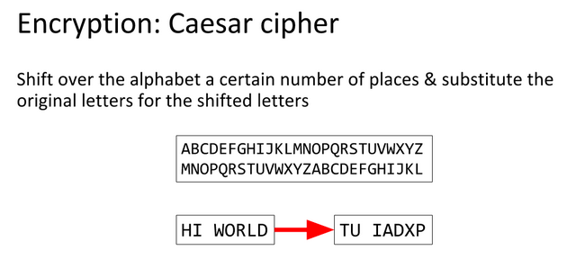

# Caesar Cipher/ROT 13

The Caesar Cipher or Caesar Shift is a cipher which uses the alphabet in order to encode texts.

`CAESAR` encoded with a shift of 8 is `KIMAIZ` so `ABCDEFGHIJKLMNOPQRSTUVWXYZ` becomes `IJKLMNOPQRSTUVWXYZABCDEFGH`

ROT13 is the same thing but a fixed shift of 13, this is a trivial cipher to bruteforce because there are only 25 shifts.

