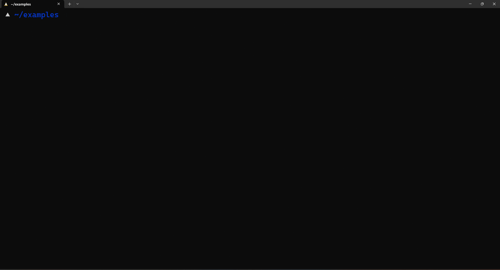

# Hex Editor

A hexadecimal (hex) editor (also called a binary file editor or byte editor) is a computer program you can use to manipulate the fundamental binary data that constitutes a computer file. The name “hex” comes from “hexadecimal,” a standard numerical format for representing binary data. A typical computer file occupies multiple areas on the platter(s) of a disk drive, whose contents are combined to form the file. 

Hex editors that are designed to parse and edit sector data from the physical segments of floppy or hard disks are sometimes called sector editors or disk editors. A hex editor is used to see or edit the raw, exact contents of a file. Hex editors may used to correct data corrupted by a system or application. A [list of editors](https://forensics.wiki/tools/#hex-editors) can be found on the forensics Wiki.

Your hex editor should have two sections, the `hexadecimal` and `character` representations of that data. It's helpful to also have a "goto" feature in your hex editor to navigate large dumps of data.

## Example

A simple CTF challenge is modifying the header of a file. In this example, I changed the first byte of this file to `AA` instead of the conventional `FF` needed in the JFIF(JPEG File Interchangable Format). Observe how it changes the behavior of the `file` command.

``` bash
▲ ~/examples xxd example | head
00000000: aad8 ffe0 0010 4a46 4946 0001 0101 0060  ......JFIF.....`
00000010: 0060 0000 fffe 003b 4352 4541 544f 523a  .`.....;CREATOR:
00000020: 2067 642d 6a70 6567 2076 312e 3020 2875   gd-jpeg v1.0 (u
00000030: 7369 6e67 2049 4a47 204a 5045 4720 7638  sing IJG JPEG v8
00000040: 3029 2c20 7175 616c 6974 7920 3d20 3930  0), quality = 90
00000050: 0aff db00 4300 0302 0203 0202 0303 0303  ....C...........
00000060: 0403 0304 0508 0505 0404 050a 0707 0608  ................
00000070: 0c0a 0c0c 0b0a 0b0b 0d0e 1210 0d0e 110e  ................
00000080: 0b0b 1016 1011 1314 1515 150c 0f17 1816  ................
00000090: 1418 1214 1514 ffdb 0043 0103 0404 0504  .........C......
▲ ~/examples file example
example: data
```
Using a hexeditor like [hexcurse](https://manpages.ubuntu.com/manpages/focal/man1/hexcurse.1.html), we can change the header back to `FF` to be recognizable again by `file`.



Finally, `file` and programs recognize the header again.

```bash
▲ ~/examples file example
example: JPEG image data, JFIF standard 1.01, resolution (DPI), density 96x96, segment length 16, comment: "CREATOR: gd-jpeg v1.0 (using IJG JPEG v80), quality = 90", baseline, precision 8, 1024x576, components 3
```