# Disk Imaging

A forensic image is an electronic copy of a drive (e.g. a hard drive, USB, etc.). It’s a bit-by-­bit or bitstream file that’s an exact, unaltered copy of the media being duplicated.

Wikipedia said that the most straight­forward disk imaging method is to read a disk from start to finish and write the data to a forensics image format. “This can be a time-consuming process, especially for disks with a large capacity."

## Checksum

Validating files is one of the most important aspects of disk forensics. This hash will change if any part of file is changed, making it great for catching alterations to the original source. 

!!! info "Validating Downloads"
    Checking the hash of a download is also good practice when using third-party vendors for common software. It catches tampered files that could potentially contain malware.
    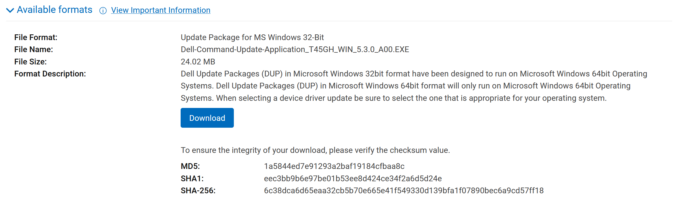

We can use tools like `md5sum` or `sha256sum` from the command line to generate the hashes of a file. *Observe the different hash when the file is altered.*
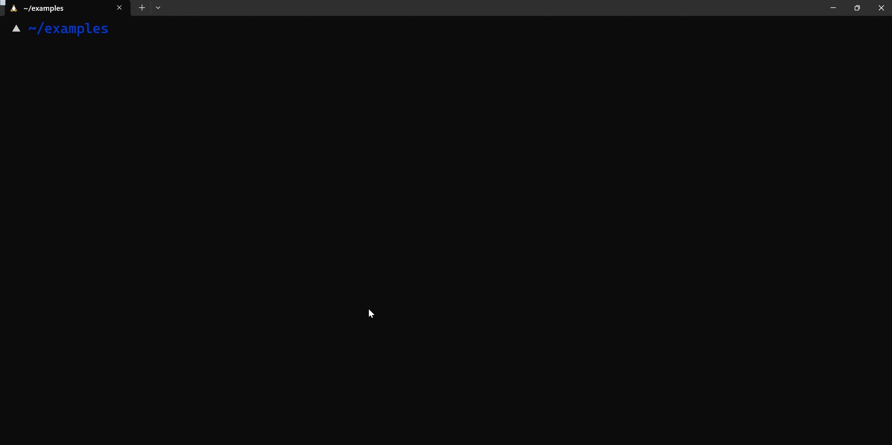

## Write Blocker

It's common practice to use a write blocker before imagining a disk. This prevents unintended writes to the disk to maintain integrity. 

[Kali Linux](https://www.kali.org/docs/general-use/kali-linux-forensics-mode/) has a "forensics" mode that features a write blocker and is designed for all sorts of forensics in mind. 

## Why image a disk? 
- Prevents tampering with the original data­ evidence
- Allows you to play around with the copy, without worrying about messing up the original

!!! Example "Forensic Image Extraction"

    This example uses the tool [AccessData FTK Imager](http://accessdata.com/product-download).

    **Step 1**: Go to `File > Create Disk Image`

    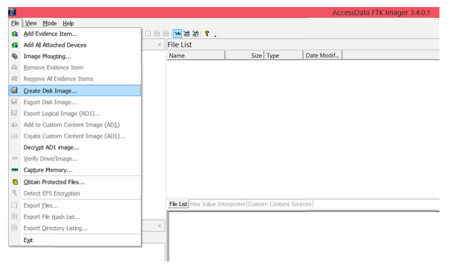

    **Step 2**: Select `Physical Drive`, because the USB or hard drive you’re imaging is a physical device or drive.

    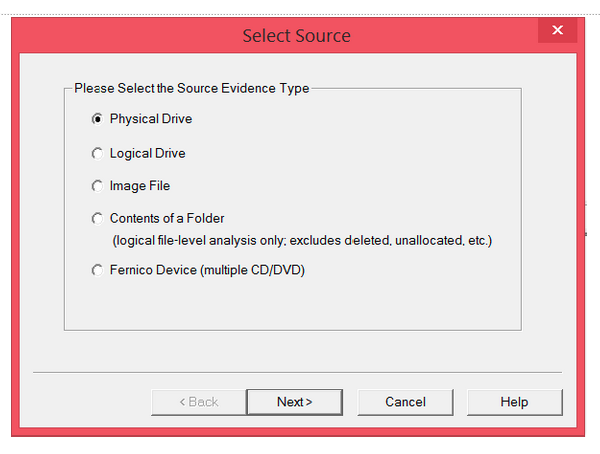

    **Step 3**: Select the drive you’re imaging. The 1000 GB is my computer hard drive; the 128 MB is the USB that I want to image.

    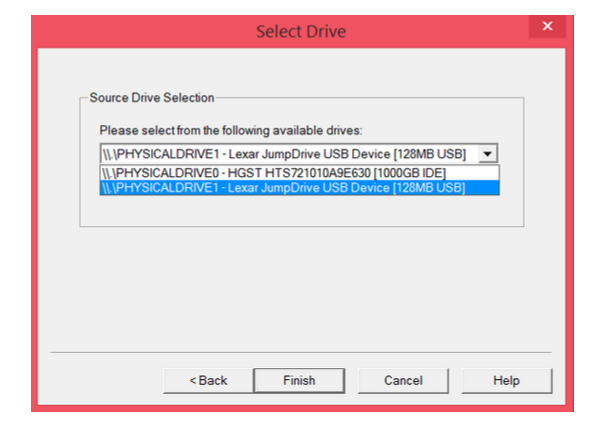

    **Step 4**: Add a new image destination

    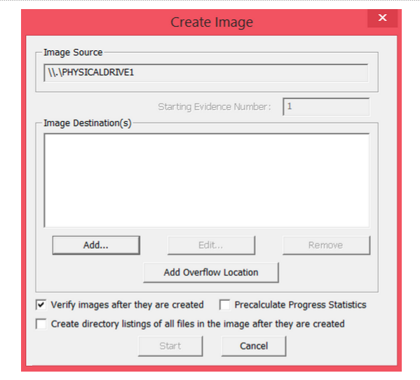

    **Step 5**: Select whichever image type you want. Choose `Raw (dd)` if you’re a beginner, since it’s the most common type

    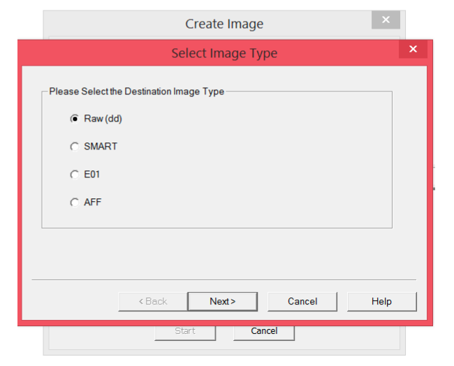

    **Step 6**: Fill in all the evidence information

    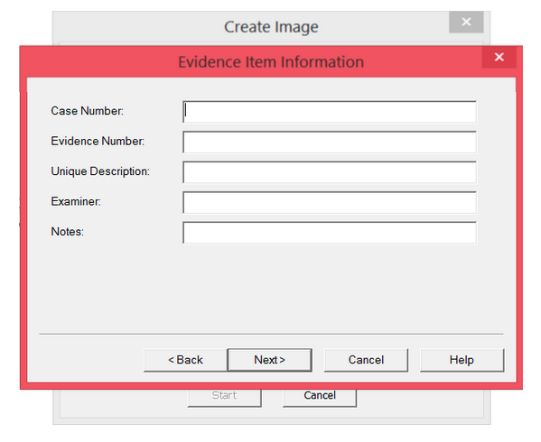

    **Step 7**: Choose where you want to store it

    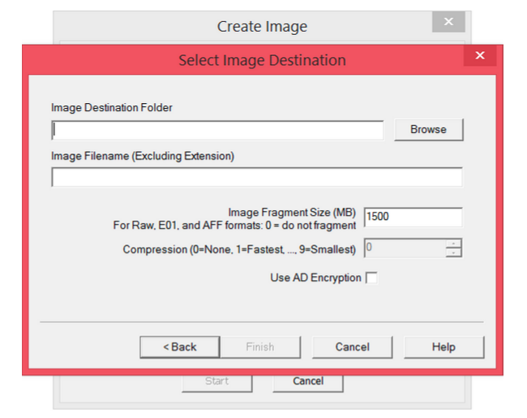

    **Step 8**: The image destination has been added. Now you can start the image extraction

    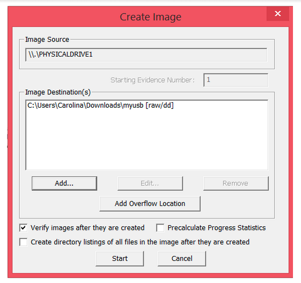

    **Step 9**: Wait for the image to be extracted

    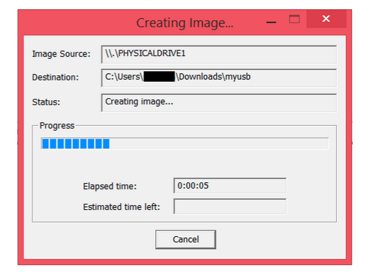

    **Step 10**: This is the completed extraction

    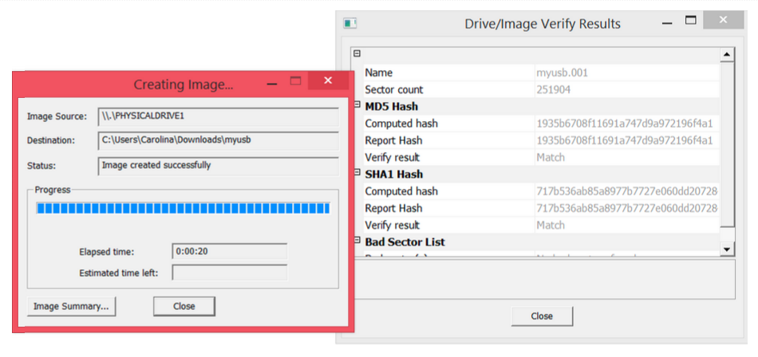

    **Step 11**: Add the image you just created so that you can view it

    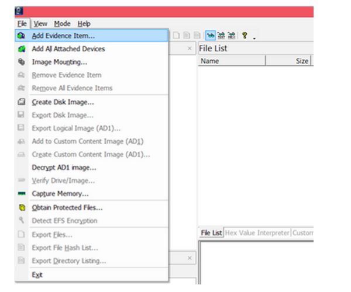

    **Step 12**: This time, choose image file, since that’s what you just created

    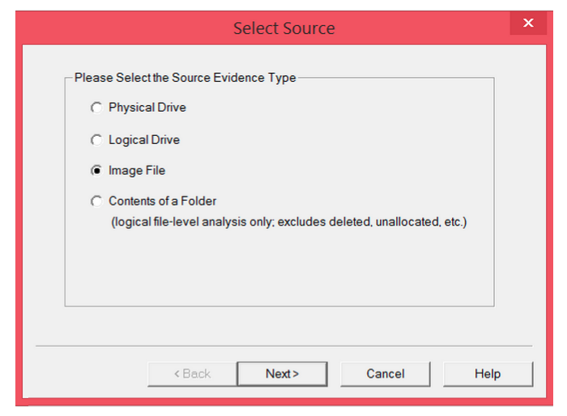

    **Step 13**: Enter the path of the image you just created

    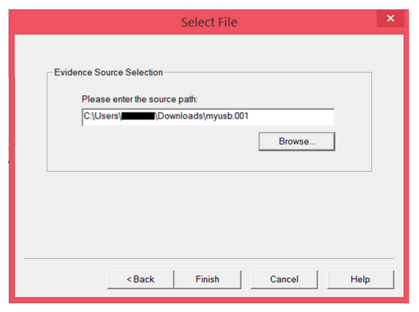

    **Step 14**: View the image.

    1. Evidence tree
    Structure of the drive image
    2. File list
    List of all the files in the drive image folder
    3. Properties
    Properties of the file/folder being examined
    4. Hex viewer
    View of the drive/folders/files in hexadecimal

    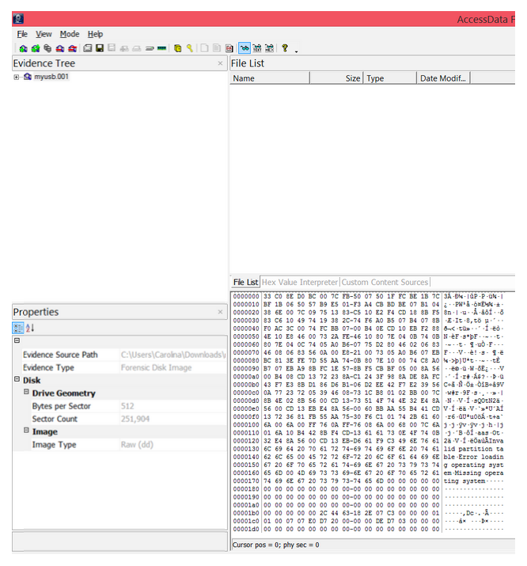

    **Step 15**: To view files in the USB, go to `Partition 1 > [USB name] > [root]` in the Evidence Tree and look in the File List

    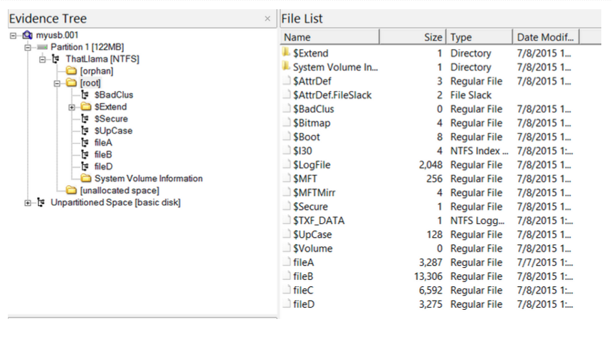

    **Step 16**: Selecting fileA, fileB, fileC, or fileD gives us some properties of the files & a preview of each photo

    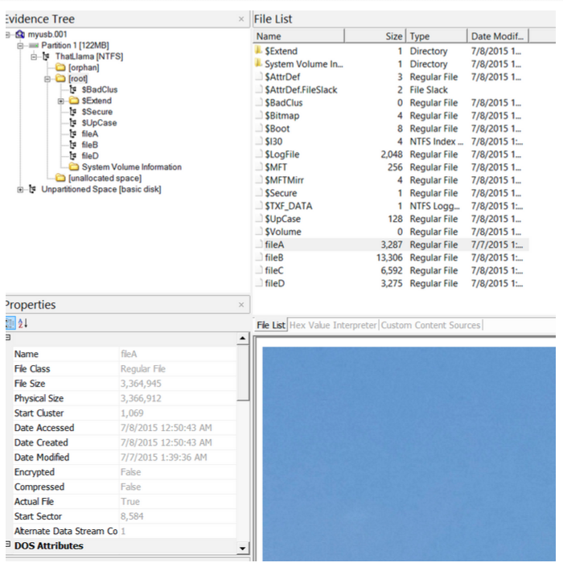

    **Step 17**: Extract files of interest for further analysis by selecting, right-clicking and choosing `Export Files`

    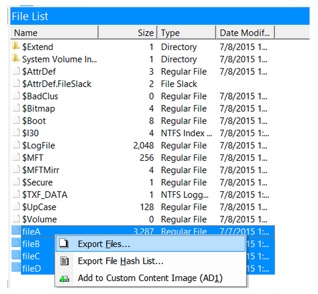