# Metadata

Metadata is data about data. Different types of files have different metadata. The metadata on a photo could include dates, camera information, GPS location, comments, etc. For music, it could include the title, author, track number and album.

## What kind of file metadata is useful?

Potentially, any file metadata you can find could be useful.

## How do I find it?

!!!note
	EXIF Data is metadata attached to photos which can include location, time, and device information.

One of our favorite tools is exiftool, which displays metadata for an input file, including:
- File size
- Dimensions (width and height)
- File type
- Programs used to create (e.g. Photoshop)
- OS used to create (e.g. Apple)

Run command line: `exiftool(-k).exe [filename]` and you should see something like this:

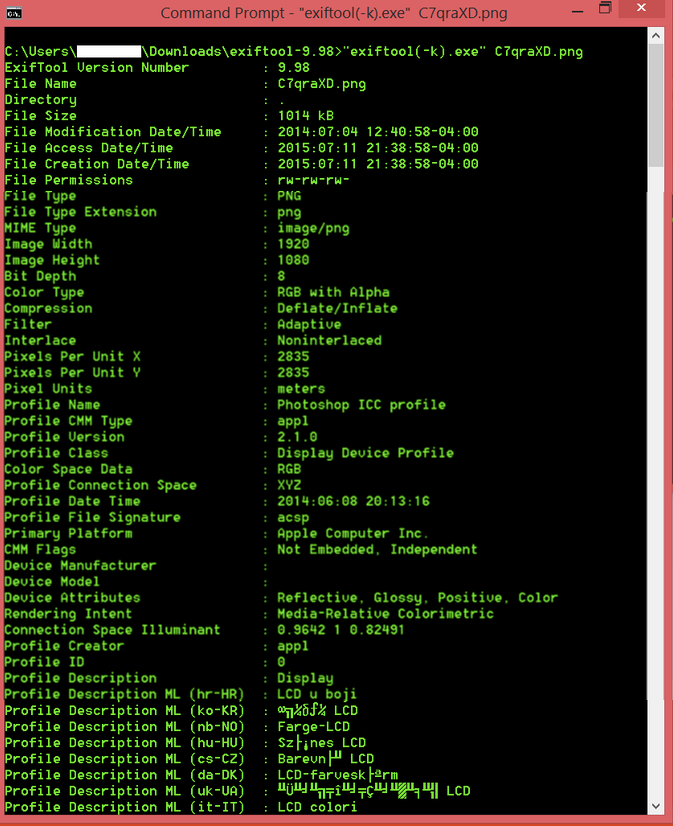

## Example

Let's take a look at File A's metadata with exiftool: 

File type

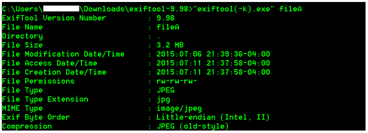

Image description

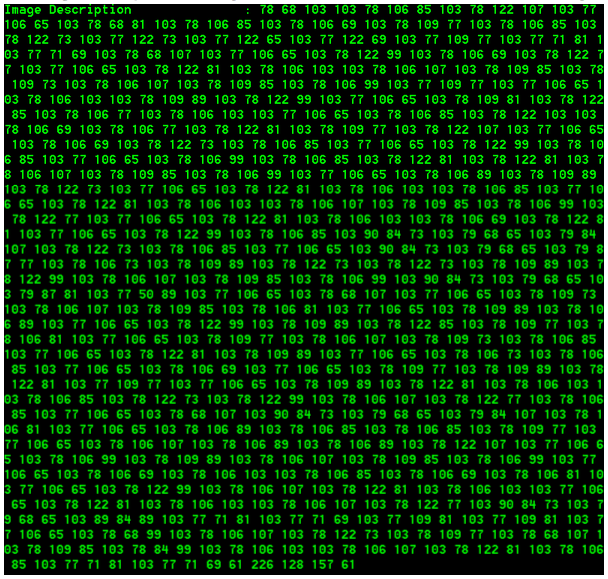

Make and camera info

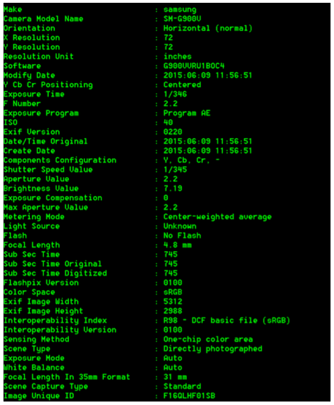

GPS Latitude/Longitude

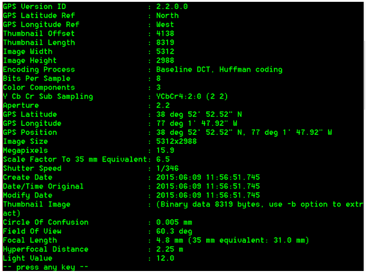

## Timestamps

Timestamps are data that indicate the time of certain events (MAC):
- Modification – when a file was modified
- Access – when a file or entries were read or accessed
- Creation – when files or entries were created

### Types of timestamps
- Modified
- Accessed
- Created
- Date Changed (MFT)
- Filename Date Created (MFT)
- Filename Date Modified (MFT)
- Filename Date Accessed (MFT)
- INDX Entry Date Created
- INDX Entry Date Modified
- INDX Entry Date Accessed
- INDX Entry Date Changed

### Why do we care?
Certain events such as creating, moving, copying, opening, editing, etc. might affect the MAC times. If the MAC timestamps can be attained, a timeline of events could be created.

### Timeline Patterns
There are plenty more patterns than the ones introduced below, but these are the basics you should start with to get a good understanding of how it works, and to complete this challenge.

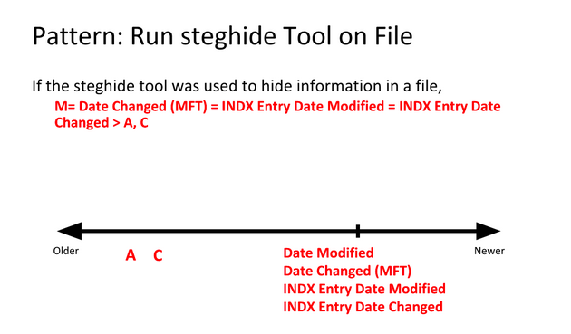
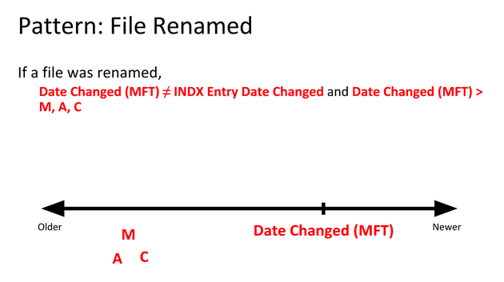
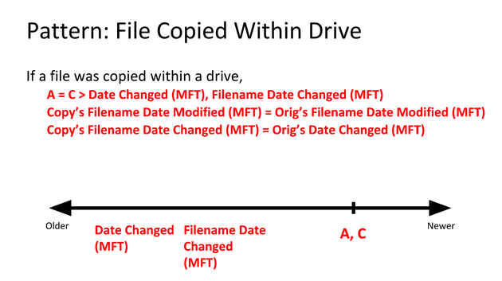
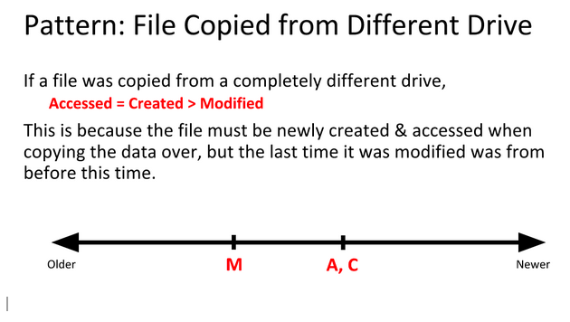
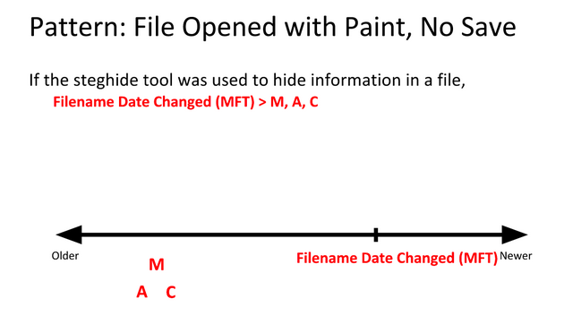

### Examples

We know that the BMP files fileA and fileD are the same, but that the JPEG files fileB and fileC are different somehow. So how can we find out what went on with these files?

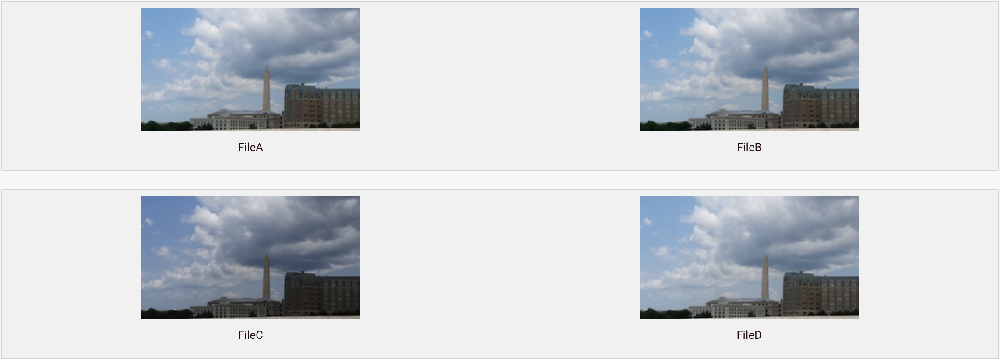

By using time stamp information from the file system, we can learn that the BMP fileD was the original file, with fileA being a copy of the original. Afterward, fileB was created by modifying fileB, and fileC was created by modifying fileA in a different way.

Follow along as we demonstrate.

We’ll start by analyzing images in AccessData FTK Imager, where there’s a Properties window that shows you some information about the file or folder you’ve selected.

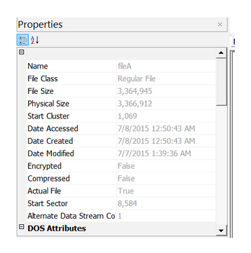
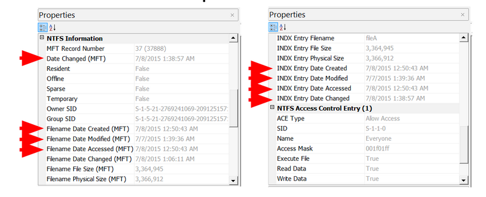

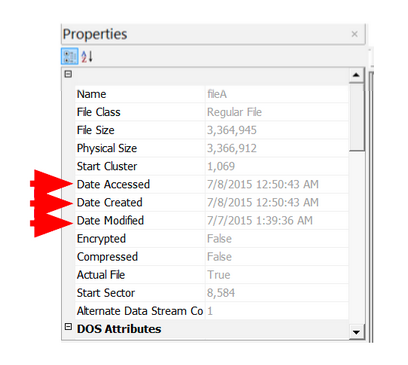

Here are the extracted MAC times for fileA, fileB, fileC and fileD:
*Note, AccessData FTK Imager assumes that the file times on the drive are in UTC (Universal Coordinated Time). I subtracted four hours, since the USB was set up in Eastern Standard Time. This isn’t necessary, but it helps me understand the times a bit better.*

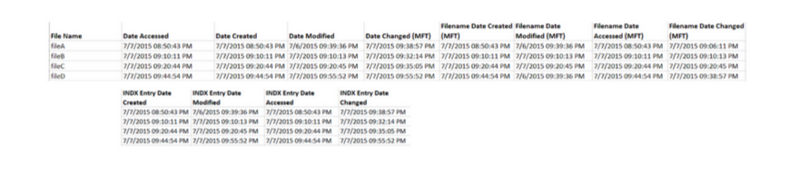

Highlight timestamps that are the same, if timestamps are off by a few seconds, they should be counted as the same. This lets you see a clear difference between different timestamps. Then, highlight oldest to newest to help put them in order.

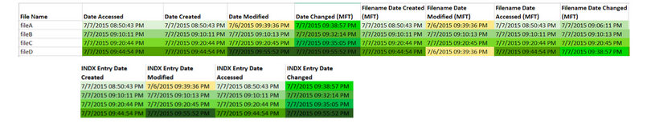
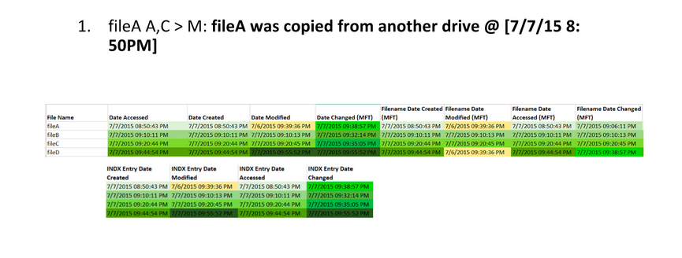
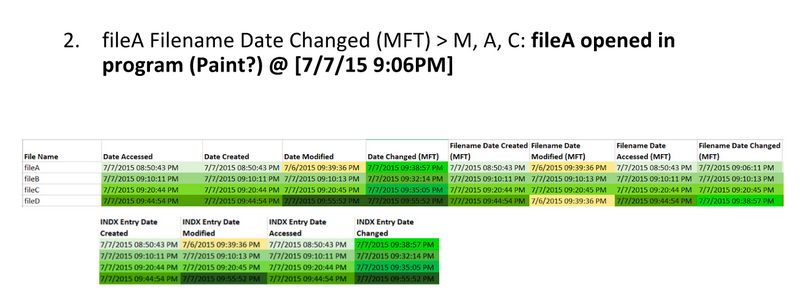
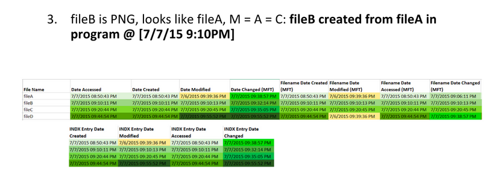
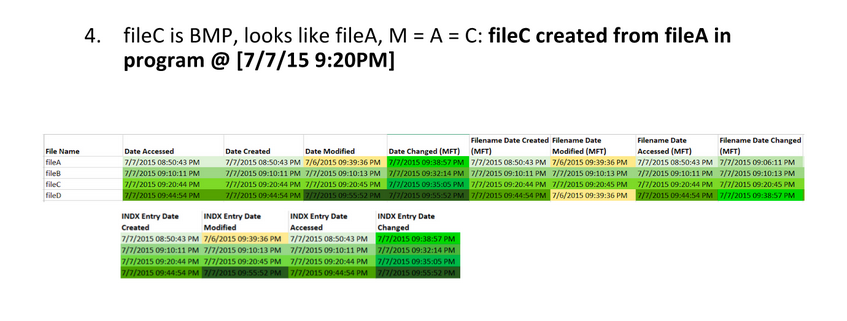
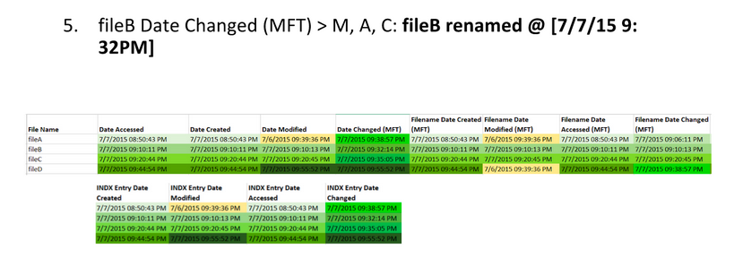
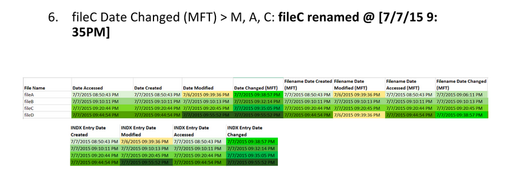
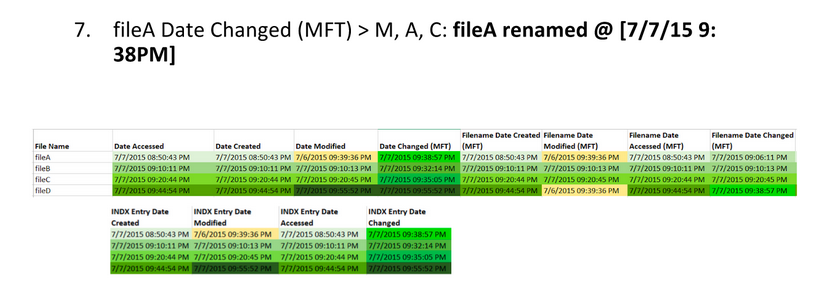
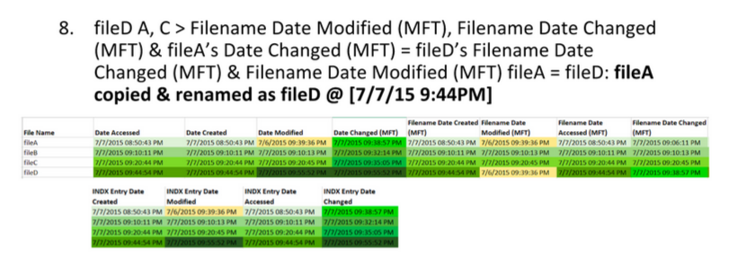
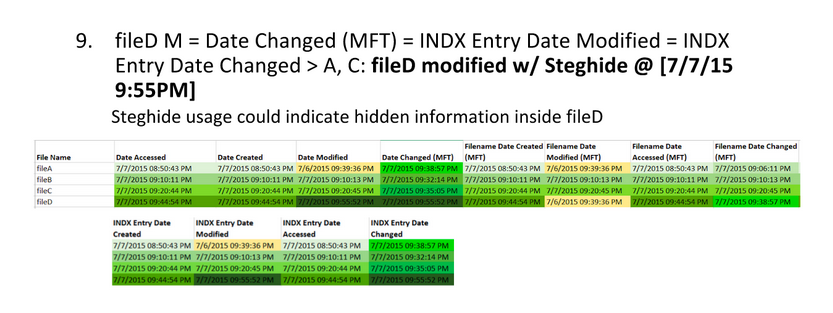

Identify timestamp patterns.

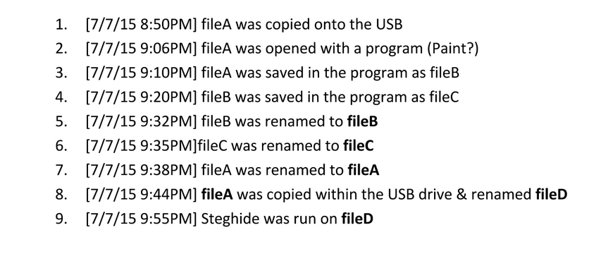
