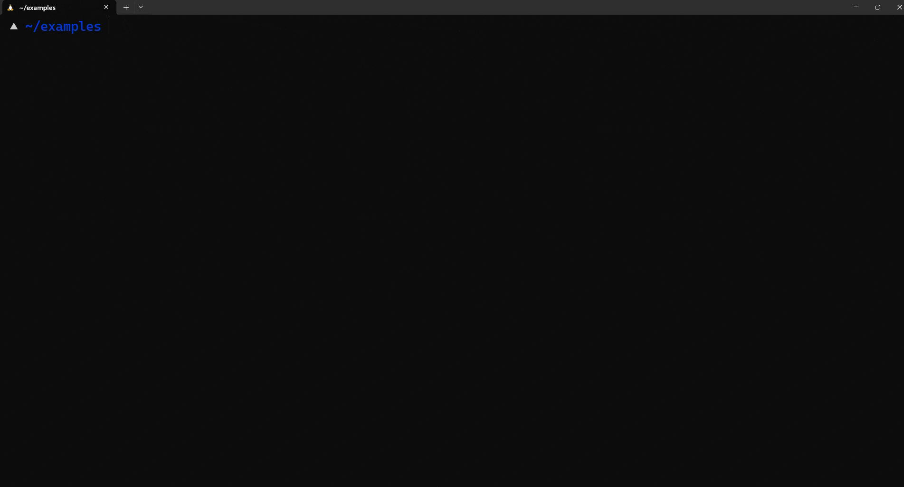

# Packet Capture

Some special challenges require competitors to capture packets from an endpoint. This guide will go over the packet-capturing tool, `tcpdump` as well as [Wireshark](https://www.wireshark.org/download.html).

!!! info
    This simulates a more realistic offensive security element of collecting data from networks. Additionally, packet captures are great for debugging networking and infrastructure. 

---

!!! abstract "`tcpdump`"

    `tcpdump` is a built in command line utility that captures network traffic and prints it out for you. For example, if I want to show all packets on the `eth0` interface. I can specify `tcpdump` to listen to it.
    ```bash
    sudo tcpdump -i eth0
    ```
    

    <!-- sorry i have to render it as javascript to get the color scheme I wanted-->
    ```javascript
    scribbl@rogstation:~/examples$ sudo tcpdump -i eth0
    tcpdump: verbose output suppressed, use -v[v]... for full protocol decode
    listening on eth0, link-type EN10MB (Ethernet), snapshot length 262144 bytes
    17:32:07.557403 IP rogstation.mshome.net.57621 > 172.22.207.255.57621: UDP, length 44
    17:32:07.633396 IP 172.22.206.250.58387 > rogstation.mshome.net.domain: 38921+ PTR? 255.207.22.172.in-addr.arpa. (45)
    17:32:07.634756 IP rogstation.mshome.net.mdns > mdns.mcast.net.mdns: 0 PTR (QM)? 255.207.22.172.in-addr.arpa.local. (51)
    17:32:07.635213 IP6 rogstation.mdns > ff02::fb.mdns: 0 PTR (QM)? 255.207.22.172.in-addr.arpa.local. (51)
    17:32:07.640442 IP rogstation.mshome.net.mdns > mdns.mcast.net.mdns: 0 PTR (QM)? 255.207.22.172.in-addr.arpa.local. (51)
    17:32:07.640689 IP6 rogstation.mdns > ff02::fb.mdns: 0 PTR (QM)? 255.207.22.172.in-addr.arpa.local. (51)
    17:32:08.718973 IP rogstation.mshome.net.mdns > mdns.mcast.net.mdns: 0 PTR (QM)? 255.207.22.172.in-addr.arpa.local. (51)
    ...
    ```

    Let's specify `tcpdump` to only list traffic from the source `172.22.206.250` and save the information to a file.
    ```python
    sudo tcpdump -i eth0 -w packets.pcap src 172.22.206.250 
    ```
    We can then use a tool like [`tshark`](https://tshark.dev/) to see our packets in the command line.

    ```javascript
    scribbl@rogstation:~/examples$ tshark -r packets.pcap
    1   0.000000 172.22.192.1 → 224.0.0.251  MDNS 87 Standard query 0x0000 PTR _spotify-connect._tcp.local, "QM" question
    2   0.000355 fe80::a6ee:2618:bd01:f6c5 → ff02::fb     MDNS 107 Standard query 0x0000 PTR _spotify-connect._tcp.local, "QM" question
    3   3.036792 172.22.192.1 → 239.255.255.250 SSDP 167 M-SEARCH * HTTP/1.1
    4  12.456780 172.22.192.1 → 172.22.207.255 UDP 86 57621 → 57621 Len=44
    5  45.024825 172.22.192.1 → 172.22.207.255 UDP 86 57621 → 57621 Len=44
    ```

---

!!! abstract "Wireshark"

    Wireshark is a really good resource to view packets and see their contents. We can also use Wireshark to capture packets on our interface just like `tcpdump`. Here in this example, I have a ping command running in a WSL instance.

    