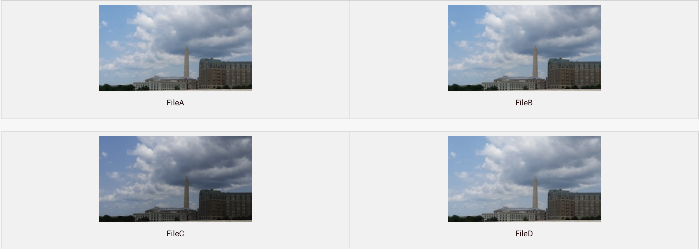
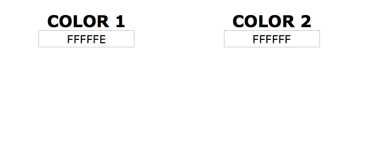

# Steganography

Steganography is the practice of hiding data in plain sight. Steganography is often embedded in images or audio.

You could send a picture of a cat to a friend and hide text inside. Looking at the image, there’s nothing to make anyone think there’s a message hidden inside it.

You could also hide a second image inside the first.

## Steganography Detection

So we can hide text and an image, how do we find out if there is hidden data?

FileA and FileD appear the same, but they’re different. Also, FileD was modified after it was copied, so it’s possible there might be steganography in it.

FileB and FileC don’t appear to have been modified after being created. That doesn’t rule out the possibility that there’s steganography in them, but you’re more likely to find it in fileD. This brings up two questions:

1. Can we determine that there is steganography in fileD?
2. If there is, what was hidden in it?

## LSB Steganography

File are made of bytes. Each byte is composed of eight bits.

Changing the least-significant bit (LSB) doesn’t change the value very much.

So we can modify the LSB without changing the file noticeably. By doing so, we can hide a message inside.

### LSB Steganography in Images

LSB Steganography or *Least Significant Bit* Steganography is a method of Steganography where data is recorded in the lowest bit of a byte.

Say an image has a pixel with an RGB value of (255, 255, 255), the bits of those RGB values will look like

| 1 | 1 | 1 | 1 | 1 | 1 | 1 | 1 |
| --- | --- | --- | --- | --- | --- | --- | --- |

By modifying the lowest, or least significant, bit, we can use the 1 bit space across every RGB value for every pixel to construct a message.

| 1 | 1 | 1 | 1 | 1 | 1 | 1 | 0 |
| --- | --- | --- | --- | --- | --- | --- | --- |

The reason steganography is hard to detect by sight is because a 1 bit difference in color is insignificant as seen below.

### Example

Let’s say we have an image, and part of it contains the following binary:

And let’s say we want to hide the character y inside.

First, we need to convert the hidden message to binary.

Now we take each bit from the hidden message and replace the LSB of the corresponding byte with it.

And again:

And again:

And again:

And again:

And again:

And again:

And once more:

Decoding LSB steganography is exactly the same as encoding, but in reverse. For each byte, grab the LSB and add it to your decoded message. Once you’ve gone through each byte, convert all the LSBs you grabbed into text or a file. (You can use your file signature knowledge here!)

## What other types of steganography are there?
Steganography is hard for the defense side, because there’s practically an infinite number of ways it could be carried out. Here are a few examples:
- LSB steganography: different bits, different bit combinations
- Encode in every certain number of bytes 
- Use a password
- Hide in different places
- Use encryption on top of steganography