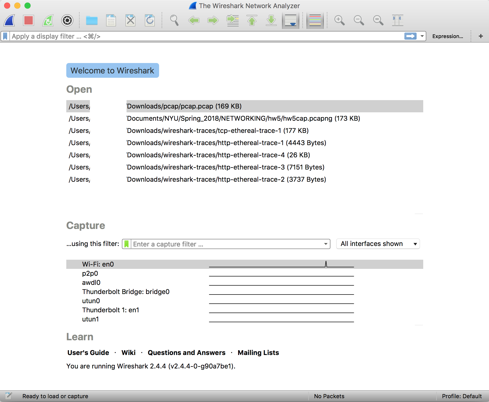
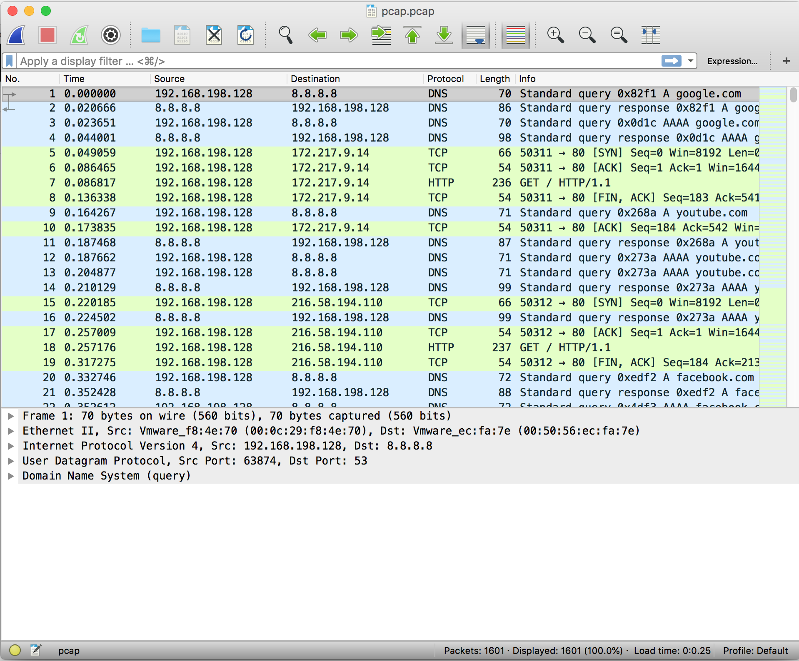
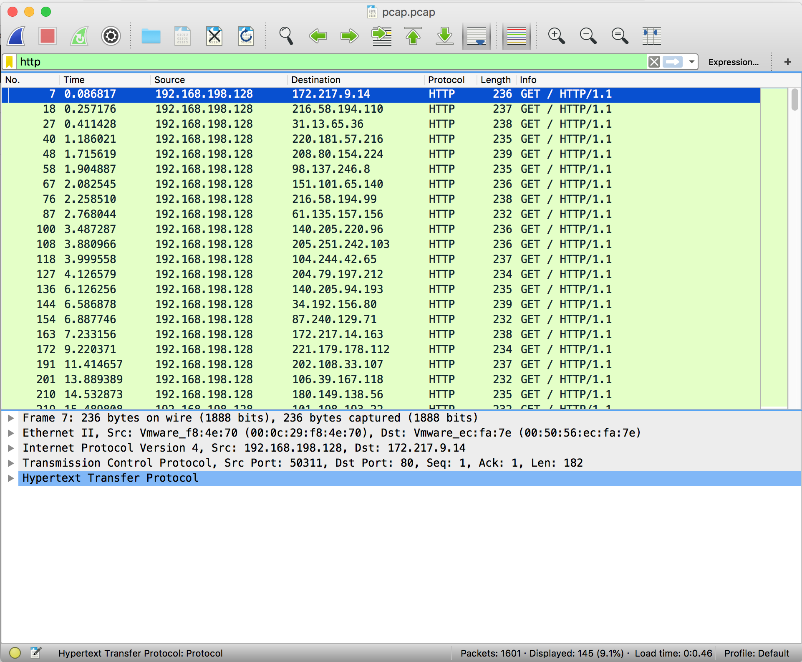
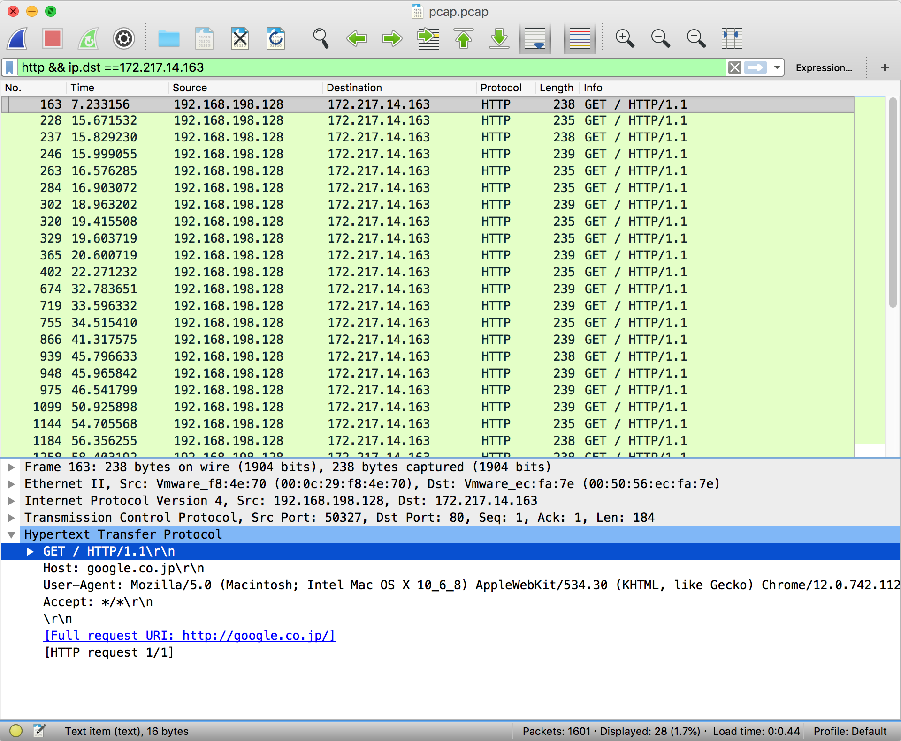
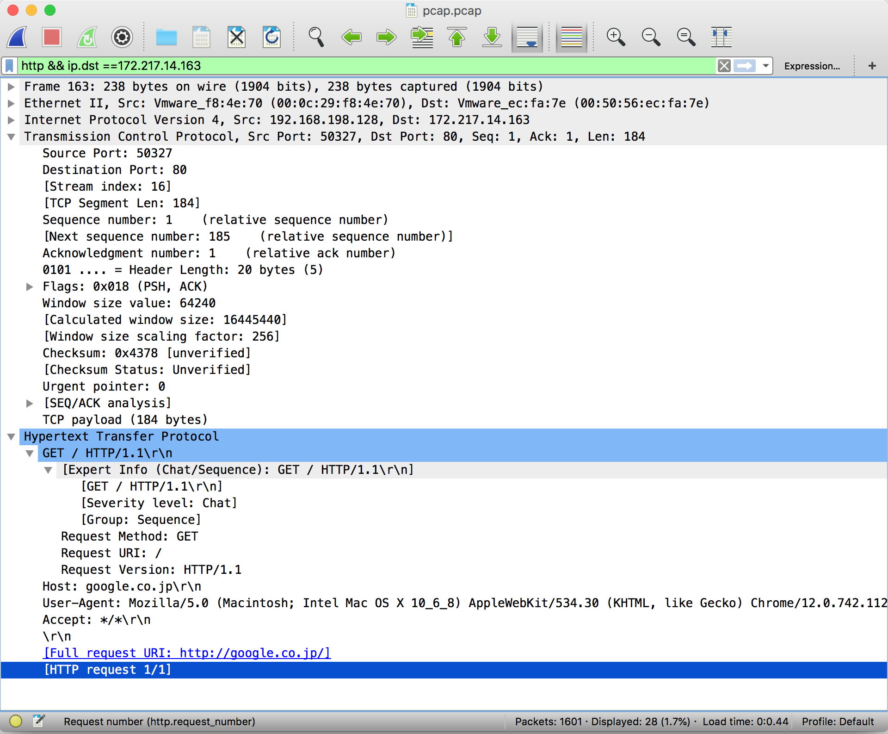
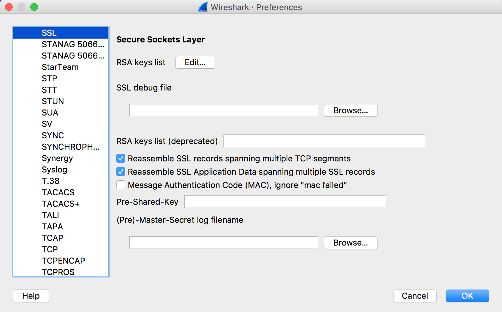

# Wireshark
!!! note "Note from our infrastructure team"

    "Wireshark saved me hours on my last tax return! - David"

    "[Wireshark] is great for ruining your weekend and fixing pesky networking problems!" - Max"

    "Wireshark is the powerhouse of the cell. - Joe"

    "Does this cable do anything? - Ayyaz"

[Wireshark](http://www.wireshark.com) is a network protocol analyzer which is often used in CTF challenges to look at recorded network traffic. Wireshark uses a filetype called PCAP to record traffic. PCAPs are often distributed in CTF challenges to provide recorded traffic history.

## Interface

Upon opening Wireshark, you are greeted with the option to open a PCAP or begin capturing network traffic on your device.

The network traffic displayed initially shows the packets in order of which they were captured. You can filter packets by protocol, source IP address, destination IP address, length, etc. 

In order to apply filters, simply enter the constraining factor, for example 'http', in the display filter bar. 

Filters can be chained together using '&&' notation. In order to filter by IP, ensure a double equals '==' is used. 

The most pertinent part of a packet is its data payload and protocol information.

## Decrypting SSL Traffic

By default, Wireshark cannot decrypt SSL traffic on your device unless you grant it specific certificates.

### High Level SSL Handshake Overview

In order for a network session to be encrypted properly, the client and server must share a common secret for which they can use to encrypt and decrypt data without someone in the middle being able to guess. The SSL Handshake loosely follows this format:

1. The client sends a list of available cipher suites it can use along with a random set of bytes referred to as client_random
2. The server sends back the cipher suite that will be used, such as TLS_DHE_RSA_WITH_AES_128_CBC_SHA, along with a random set of bytes referred to as server_random
3. The client generates a pre-master secret, encrypts it, then sends it to the server.
4. The server and client then generate a common master secret using the selected cipher suite
5. The client and server begin communicating using this common secret

### Decryption Requirements

There are several ways to be able to decrypt traffic.

- If you have the client and server random values *and* the pre-master secret, the master secret can be generated and used to decrypt the traffic
- If you have the master secret, traffic can be decrypted easily
- If the cipher-suite uses RSA, you can factor *n* in the key in order to break the encryption on the encrypted pre-master secret and generate the master secret with the client and server randoms 

