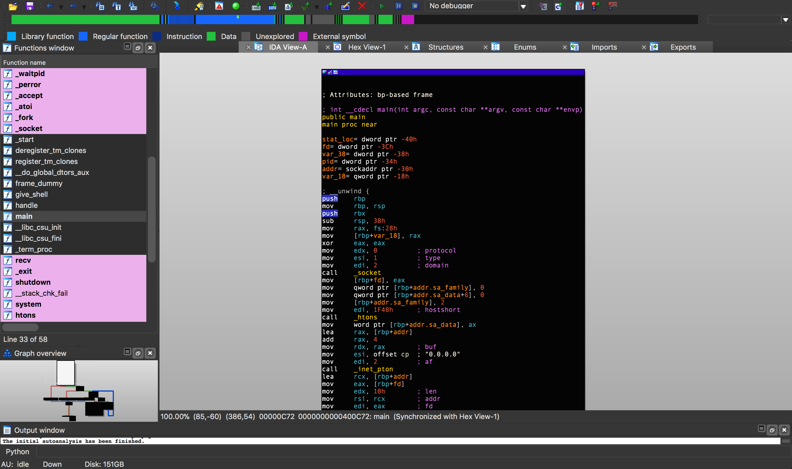
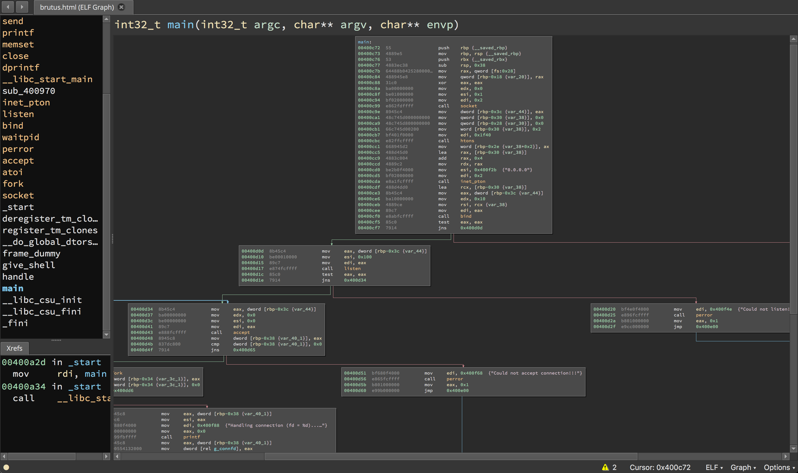
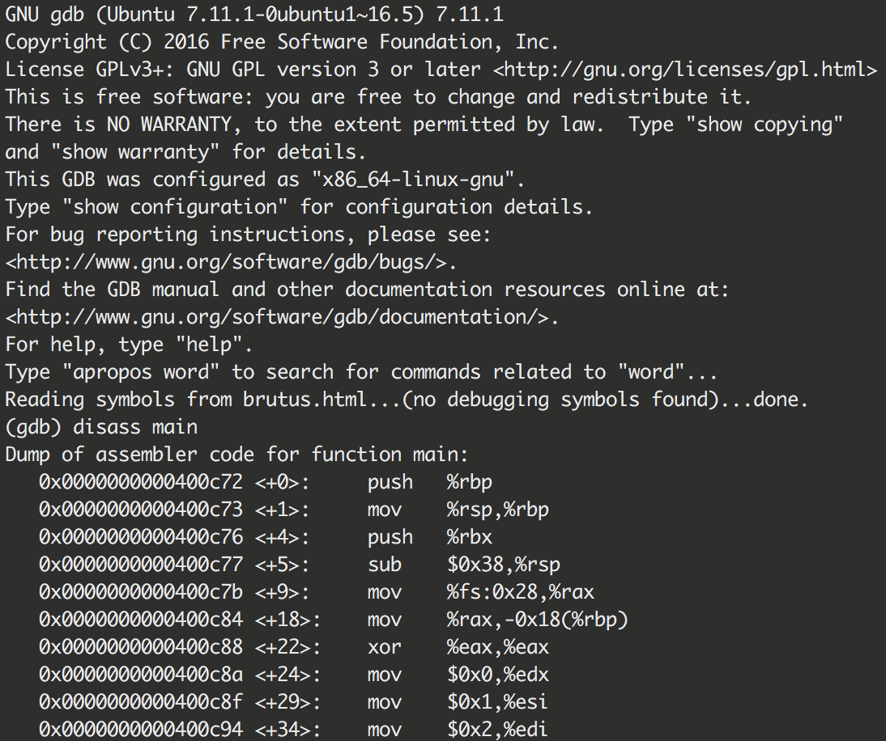

# Disassemblers

A **disassembler** is a tool which breaks down a compiled program into machine code.

## List of Disassemblers

- IDA
- Binary Ninja
- GNU Debugger (GDB)
- radare2
- Hopper

### IDA

The Interactive Disassembler (IDA) is capable of disassembling "virtually any popular file format". This makes it very useful to security researchers and CTF players who often need to analyze obscure files without knowing what they are or where they came from. IDA features the Hex Rays decompiler which can convert assembly code back into a pseudo code like format.

IDA also has a plugin interface which has been used to create some successful plugins that can make reverse engineering easier:

 * https://github.com/google/binnavi
 * https://github.com/yegord/snowman
 * https://github.com/gaasedelen/lighthouse
 * https://github.com/joxeankoret/diaphora
 * https://github.com/REhints/HexRaysCodeXplorer
 * https://github.com/osirislab/Fentanyl

You can use IDA for free, with some limitations: https://hex-rays.com/ida-free

### Binary Ninja

Binary Ninja is an interactive decompiler, disassembler, debugger, and binary analysis platform. While it's less popular or as old as IDA, Binary Ninja (often called 'binja') is quickly gaining ground and has a growing community of dedicated users and followers. Binary Ninja also features decompilation for all architectures, which can convert assembly code back into a pseudo code like format represented as their High-Level IL, pseudo-C, pseudo-Rust, pseudo-Python, or [your own](https://github.com/Vector35/binaryninja-api/blob/dev/python/examples/pseudo_python.py) using their Python, C++, or Rust plugin APIs.

Binja also has some community contributed plugins which are collected here: https://github.com/Vector35/community-plugins

You can use Binary Ninja for free, with some limitations: https://binary.ninja/free/

### gdb

The GNU Debugger is a free and open source debugger which also disassembles programs. It's capable as a disassembler, but most notably it is used by CTF players for its debugging and dynamic analysis capabailities.

gdb is often used in tandom with enhancement scripts like [peda](https://github.com/longld/peda), [pwndbg](https://github.com/pwndbg/pwndbg), and [GEF](https://github.com/hugsy/gef)

