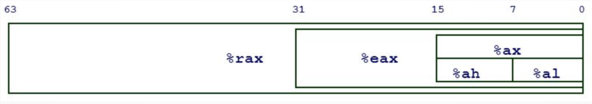

# Assembly/Machine Code

Machine Code or Assembly is code which has been formatted for direct execution by a CPU. Machine Code is the reason why readable programming languages like C, when compiled, cannot be reversed into source code (well [Decompilers]() can sort of, but more on that later).

## From Source to Compilation

[Godbolt](https://godbolt.org) shows the differences in machine code generated by various compilers.

For example, if we have a simple C++ function:

```c
#include <unistd.h>
#include <stdio.h>
#include <stdlib.h>

int main() {
    char c;
    int fd = syscall(2, "/etc/passwd", 0);
    while (syscall(0, fd, &c, 1)) {
        putchar(c);
    }
}
```

We can see the compilation results in some verbose instructions for the CPU:

```
.LC0:
  .string "/etc/passwd"
main:
  push rbp
  mov rbp, rsp
  sub rsp, 16
  mov edx, 0
  mov esi, OFFSET FLAT:.LC0
  mov edi, 2
  mov eax, 0
  call syscall
  mov DWORD PTR [rbp-4], eax
.L3:
  lea rdx, [rbp-5]
  mov eax, DWORD PTR [rbp-4]
  mov ecx, 1
  mov esi, eax
  mov edi, 0
  mov eax, 0
  call syscall
  test rax, rax
  setne al
  test al, al
  je .L2
  movzx eax, BYTE PTR [rbp-5]
  movsx eax, al
  mov edi, eax
  call putchar
  jmp .L3
.L2:
  mov eax, 0
  leave
  ret
```

This is a one way process for compiled languages as there is no way to generate source from machine code. While the machine code may seem unintelligible, the extremely basic functions can be interpreted with some practice.

## x86-64

x86-64 or amd64 or i64 is a 64-bit Complex Instruction Set Computing (CISC) architecture. This basically means that the registers used for this architecture extend an extra 32-bits on Intel's x86 architecture. CISC means that a single instruction can do a bunch of different things at once, such as memory accesses, register reads, etc. It is also a variable-length instruction set, which means different instructions can be different sizes ranging from 1 to 16 bytes long. And finally x86-64 allows for multi-sized register access, which means that you can access certain parts of a register which are different sizes.

### x86-64 Registers

x86-64 registers behave similarly to other architectures. A key component of x86-64 registers is multi-sized access which means the register RAX can have its lower 32 bits accessed with EAX. The next lower 16 bits can be accessed with AX and the lowest 8 bits can be accessed with AL which allows for the compiler to make optimizations which boost program execution.


x86-64 has plenty of registers to use, including rax, rbx, rcx, rdx, rdi, rsi, rsp, rip, r8-r15, and more! But some registers serve special purposes.

The special registers include:
- RIP: the instruction pointer
- RSP: the stack pointer
- RBP: the base pointer

### Instructions

An **instruction** represents a single operation for the CPU to perform.

There are different types of instructions including:

- Data movement: `mov rax, [rsp - 0x40]`
- Arithmetic: `add rbx, rcx`
- Control-flow: `jne 0x8000400`

Because x86-64 is a CISC architecture, instructions can be quite complex for machine code, such as `repne scasb` which repeats up to ECX times over memory at EDI looking for a NULL byte (0x00), decrementing ECX each byte (essentially strlen() in a single instruction!).

It is important to remember that an instruction really is just memory; this idea will become useful with Return Oriented Programming or ROP.

!!! Note
    Instructions, numbers, strings, everything are always represented in hex!

```
add rax, rbx
mov rax, 0xdeadbeef
mov rax, [0xdeadbeef] == 67 48 8b 05 ef be ad de
"Hello" == 48 65 6c 6c 6f
== 48 01 d8
== 48 c7 c0 ef be ad de
```

### Execution

What should the CPU execute? This is determined by the RIP register where IP means instruction pointer. Execution follows the pattern: fetch the instruction at the address in RIP, decode it, run it.

### Examples

1. `mov rax, 0xdeadbeef`

Here the operation `mov` is moving the "immediate" `0xdeadbeef` into the register `RAX`

2. `mov rax, [0xdeadbeef + rbx * 4]`

Here the operation `mov` is moving the data at the address of `[0xdeadbeef + RBX*4]` into the register `RAX`. When brackets are used, you can think of the program as getting the content from that effective address.

### Example Execution
```
-> 0x0804000: mov eax, 0xdeadbeef            Register Values:
   0x0804005: mov ebx, 0x1234                RIP = 0x0804000
   0x080400a: add, rax, rbx                  RAX = 0x0
   0x080400d: inc rbx                        RBX = 0x0
   0x0804010: sub rax, rbx                   RCX = 0x0
   0x0804013: mov rcx, rax                   RDX = 0x0
```

```
   0x0804000: mov eax, 0xdeadbeef            Register Values:
-> 0x0804005: mov ebx, 0x1234                RIP = 0x0804005
   0x080400a: add, rax, rbx                  RAX = 0xdeadbeef
   0x080400d: inc rbx                        RBX = 0x0
   0x0804010: sub rax, rbx                   RCX = 0x0
   0x0804013: mov rcx, rax                   RDX = 0x0
```

```
   0x0804000: mov eax, 0xdeadbeef            Register Values:
   0x0804005: mov ebx, 0x1234                RIP = 0x080400a
-> 0x080400a: add, rax, rbx                  RAX = 0xdeadbeef
   0x080400d: inc rbx                        RBX = 0x1234
   0x0804010: sub rax, rbx                   RCX = 0x0
   0x0804013: mov rcx, rax                   RDX = 0x0
```

```
   0x0804000: mov eax, 0xdeadbeef            Register Values:
   0x0804005: mov ebx, 0x1234                RIP = 0x080400d
   0x080400a: add, rax, rbx                  RAX = 0xdeadd123
-> 0x080400d: inc rbx                        RBX = 0x1234
   0x0804010: sub rax, rbx                   RCX = 0x0
   0x0804013: mov rcx, rax                   RDX = 0x0
```

```
   0x0804000: mov eax, 0xdeadbeef            Register Values:
   0x0804005: mov ebx, 0x1234                RIP = 0x0804010
   0x080400a: add, rax, rbx                  RAX = 0xdeadd123
   0x080400d: inc rbx                        RBX = 0x1235
-> 0x0804010: sub rax, rbx                   RCX = 0x0
   0x0804013: mov rcx, rax                   RDX = 0x0
```

```
   0x0804000: mov eax, 0xdeadbeef            Register Values:
   0x0804005: mov ebx, 0x1234                RIP = 0x0804013
   0x080400a: add, rax, rbx                  RAX = 0xdeadbeee
   0x080400d: inc rbx                        RBX = 0x1235
   0x0804010: sub rax, rbx                   RCX = 0x0
-> 0x0804013: mov rcx, rax                   RDX = 0x0
```

```
   0x0804000: mov eax, 0xdeadbeef            Register Values:
   0x0804005: mov ebx, 0x1234                RIP = 0x0804005
   0x080400a: add, rax, rbx                  RAX = 0xdeadbeee
   0x080400d: inc rbx                        RBX = 0x1235
   0x0804010: sub rax, rbx                   RCX = 0xdeadbeee
   0x0804013: mov rcx, rax                   RDX = 0x0
```

### Control Flow

How can we express conditionals in x86-64? We use conditional jumps such as:

- `jnz <address>`
- `je <address>`
- `jge <address>`
- `jle <address>`
- etc.

They jump if their condition is true, and just go to the next instruction otherwise. These conditionals are checking EFLAGS, which are special registers which store flags on certain instructions such as `add rax, rbx` which sets the o (overflow) flag if the sum is greater than a 64-bit register can hold, and wraps around. You can jump based on that with a `jo` instruction. The most important thing to remember is the cmp instruction:
```
cmp rax, rbx
jle error
```
This assembly jumps if RAX <= RBX

### Addresses

Memory acts similarly to a big array where the indices of this "array" are memory addresses. Remember from earlier:

`mov rax, [0xdeadbeef]`

The square brackets mean "get the data at this address". This is analogous to the C/C++ syntax: `rax = *0xdeadbeef;`
