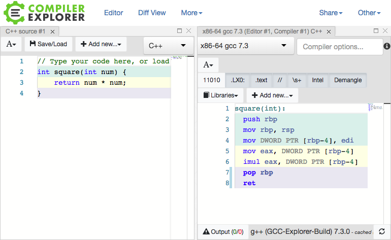

# The C Programming Language

## History

The C programming language was written by Dennis Ritchie in the 1970s while he was working at Bell Labs. It was first used to reimplement the Unix operating system which was purely written in assembly language. At first, the Unix developers were considering using a language called "B" but because B wasn't optimized for the target computer, the C language was created.

!!! note
    C is the letter and the programming language after B!

C was designed to be close to assembly and is still widely used in lower level programming where speed and control are needed (operating systems, embedded systems). C was also very influential to other programming languages used today. Notable languages include C++, Objective-C, Golang, Java, JavaScript, PHP, Python, and Rust.


## Hello World

C is an ancestor of many other programming languages and if you are familiar with programming, it's likely that C will be at least somewhat familiar.

```c
#include <stdio.h>
int main()
{
   printf("Hello, World!");
   return 0;
}
```


## Today

Today C is widely used either as a low level programming language or is the base language that other programming languages are implemented in.

While it can be difficult to see, the C language compiles down directly into machine code. The compiler is programmed to process the provided C code and emit assembly that's targetted to whatever operating system and architecture the compiler is set to use.

Some common compilers include:

 * gcc
 * clang

A good way to explore this relationship is to use this online [GCC Explorer](https://godbolt.org/#) from Matt Godbolt.



In regards to CTF, many reverse engineering and exploitation CTF challenges are written in C because the language compiles down directly to assembly and there are little to no safeguards in the language. This means developers must manually handle both. Of course, this can lead to mistakes which can sometimes lead to security issues.

!!! note
    Other higher level languages like Python manage memory and garbage collection for you. Google Golang was inspired by C, but adds in functionality like garbage collection and memory safety.

There are some examples of famously vulnerable functions in C which are still available and can still result in vulnerabilities:

 * `gets` - Can result in buffer overflows
 * `strcpy` - Can result in buffer overflows
 * `strcat` - Can result in buffer overflows
 * `strcmp` - Can result in timing attacks

## Types

C has four basic types:

 * char - characters
 * int - integers (e.g. 125)
 * float - 32 bit floating point number (e.g. 2.4)
 * double - 64 bit floating point number (like a float but more precise in terms of decimal points)

## Pointers

C uses an idea known as pointers. A pointer is a variable which contains the address of another variable.

To understand this idea we should first understand that memory is laid out in terms of addresses and data gets stored at these addresses.

Take the following example of defining an integer in C:

```c
int x = 4;
```

To the programmer this is the variable `x` receiving the value of 4. The computer stores this value in some location in memory. For example we can say that address `0x1000` now holds the value `4`. The computer knows to directly access the memory and retrieve the value `4` whenever the programmer tries to use the `x` variable. If we were to say `x + 4`, the computer would give you `8` instead of `0x1004`.

But in C we can retrieve the memory address being used to hold the 4 value (i.e. 0x1000) by using the `&` character and using `*` to create an "integer pointer" type.

```c
int* y = &x;
```

The `y` variable will store the address pointed to by the `x `variable (0x1000).

!!! note
    The `*` character allows us to declare pointer variables but also allows us to access the value stored at a pointer. For example, entering `*y` allows us to access the 4 value instead of 0x1000.

Whenever we use the `y` variable we are using the memory address, but if we use the `x` variable we use the value stored at the memory address.

## Arrays

Arrays are a grouping of objects of the same type. They are typically created with the following syntax:

```c
type arrayName [ arraySize ];
```

To initialize values in the array we can do:

```c
int integers[ 10 ] = {1, 2, 3, 4, 5, 6, 7, 8, 9, 10};
```

Arrays allow programmers to group data into logical containers.

To access the individual elements of an array we access the contents by their "index". Most programming languages today start counting from 0. So to take our previous example:

```c
int integers[ 10 ] = {1, 2, 3, 4, 5, 6, 7, 8, 9, 10};
/*     indexes        0  1  2  3  4  5  6  7  8   9
```

To access the value 6 we would use index 5:

```c
integers[5];
```

### How do arrays work?

Arrays are a clever combination of multiplication, pointers, and programming.

Because the computer knows the data type used for every element in the array, the computer needs to simply multiply the size of the data type by the index you are looking for and then add this value to the address of the beginning of the array.

For example if we know that the base address of an array is 1000 and we know that each integer takes 8 bytes, we know that if we have 8 integers right next to each other, we can get the integer at the 4th index with the following math:

```c
1000 + (8 * 4) =  1032
```

```c
array [ 1   , 2   , 3   , 4   , 5   , 6   , 7   , 8   ]
index   0     1     2     3     4     5     6     7
addrs  1000  1008  1016  1024  1032  1040  1048  1056
```

## Memory Management

### Memory safety issues with Pointers

Because C requires programmers to manually manage memory, it trusts the developer to handle pointers safely. Since the compiler does not include built-in bounds checking or garbage collection (unlike higher-level languages), pointers are often the source of bugs and security vulnerabilities. 

Below are four of the most common memory safety issues related to pointers:

#### 1. Out-of-Bounds Access (Pointer Arithmetic)

As mentioned in the Arrays section, C allows you to use mathematical operations on pointers to navigate memory. However, C does not check if you have moved past the bounds of your allocated memory. If you shift a pointer too far, you will begin reading or writing to unallocated memory or memory owned by other parts of the program. This can lead to application crashes or allow attackers to overwrite sensitive data.

```c
int arr[3] = {10, 20, 30};
int *ptr = arr; // ptr points to the first element (10)

ptr += 5; // Shifts the pointer 5 positions forward

// The program is now accessing memory outside of the 'arr' bounds
*ptr = 99; 

```

#### 2. Dangling Pointers (Use-After-Free)

When you dynamically allocate memory using functions like `malloc`, you must eventually release it back to the system using `free`. A dangling pointer occurs when you free the memory, but the pointer variable retains the old memory address. If your program writes to this address later, it will corrupt data, as that memory may have been reallocated for another purpose by the operating system.

```c
#include <stdlib.h>

int *ptr = (int *)malloc(sizeof(int)); // Allocate memory
*ptr = 42; 

free(ptr); // Release the memory back to the system

// ptr still holds the old address, but the program no longer owns the memory
*ptr = 100; 

```

#### 3. Uninitialized Pointers

If a pointer is declared but not assigned a specific memory address, it will simply hold whatever random data was previously sitting in that location. Dereferencing an uninitialized pointer means the program is attempting to access a random memory address, which typically results in an immediate crash known as a segmentation fault.

```c
int *uninitialized_ptr; // Declared, but not assigned a valid address

// Attempts to write to a random memory address, causing a segmentation fault
*uninitialized_ptr = 5; 

```

#### 4. Null Pointer Dereference

To prevent uninitialized pointers, it is standard practice to set pointers to `NULL` (address `0x0`) when they are not actively pointing to valid data. However, if a program attempts to read or write to a `NULL` pointer before it is assigned a valid address, the operating system will intervene and crash the program to protect the system.

```c
#include <stddef.h>

int *ptr = NULL; // Explicitly points to nothing (0x0)

// The operating system will terminate the program because address 0x0 cannot be accessed
int value = *ptr; 

```


